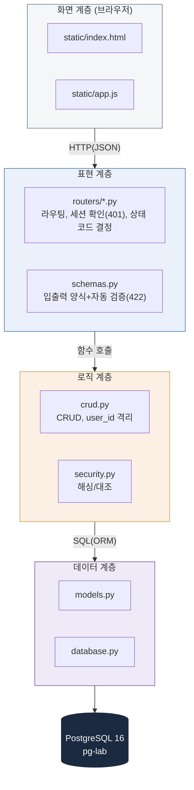

## 2. 시스템 아키텍처

4계층 구조(1차 과제 3계층 대비 화면 계층이 물리적으로 분리):

> 💡 v1.0의 ASCII 박스 다이어그램을 머메이드로 전환했습니다. 화살표 방향(단방향, 위→아래)이 핵심이며, 각 계층이 "어떤 파일에 무엇을 담는가"까지 한 그림 안에 넣었습니다.

| 계층 | 책임 | 위치 | 1차 대응물 |
|---|---|---|---|
| 화면 | 입력 수집, fetch 호출, DOM 갱신 | static/*.html, *.js | print+input |
| 표현 | 라우팅, 인증 확인, 검증, 응답 포장 | main.py, routers/*, schemas.py | (신규) |
| 로직 | CRUD, 격리, 해싱, 중복/FK 검증 | crud.py, security.py | validate_*, add_member |
| 데이터 | 테이블, 연결, 영속화 | models.py, database.py, PostgreSQL | dict+pickle |

**설계 원칙**: 계층 간 의존은 위→아래 단방향이며, 로직 계층은 표현 계층을 참조하지 않는다. 화면을 모바일 앱으로 교체해도 로직/데이터 계층은 재사용 가능해야 하며, DB 교체 시 표현 계층은 영향받지 않아야 한다.