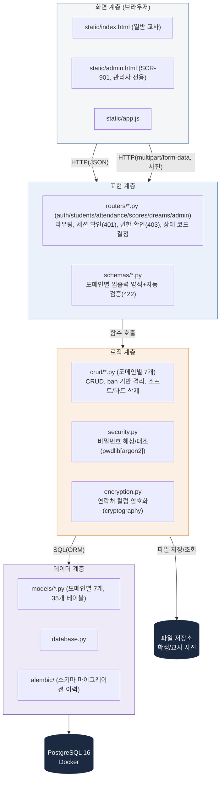

## 2. 시스템 아키텍처 (toyo 프로젝트, 재검증본)

4계층 구조는 그대로 유효하나, contact-manager(테이블 2개·단일 파일 구조)를 그대로 복사한 흔적이 남아있어 **①패키지 분리(§11), ②격리 기준(user_id→ban), ③사진 업로드 파일 저장소, ④Alembic 위치**를 반영해 재검증했다.

| 계층 | 책임 | 위치 | 비고 |
|---|---|---|---|
| 화면 | 입력 수집, fetch 호출, DOM 갱신 | static/*.html, *.js | 일반 교사 화면과 관리자 화면(SCR-901)이 정적 파일 단계에서부터 분리 |
| 표현 | 라우팅, 인증/권한 확인, 검증, 응답 포장 | main.py, routers/*, schemas/* | 401(세션) + 403(권한, 신규) 둘 다 이 계층에서 처리 |
| 로직 | CRUD, ban 격리, 소프트/하드 삭제, 해싱, 암호화, 중복/채번 검증 | crud/*, security.py, encryption.py | `user_id` 격리가 아니라 **`ban`(담당 반) 격리**, 삭제는 소프트 기본/하드 CASCADE 예외(§9) |
| 데이터 | 테이블, 연결, 스키마 이력, 영속화 | models/*, database.py, alembic/, PostgreSQL | 35개 테이블, 마이그레이션 이력 관리 포함 |

### 재검증 결과 — 수정/추가한 부분

1. **`user_id` 격리 → `ban`(담당 반) 격리로 정정**: contact-manager는 "내 데이터만" 필터였지만, toyo는 "내가 담당하는 반의 데이터만"이 격리 기준이다(§9). 원본 표를 그대로 쓰면 로직 계층 책임 설명이 toyo 실제 구조와 어긋난다.
2. **단일 파일(`crud.py`, `models.py`, `schemas.py`) → 도메인별 패키지로 정정**: §11에서 이미 `models/`, `schemas/`, `crud/` 각 7개 파일로 분리하기로 결정했는데, 원본 아키텍처 표에는 여전히 단일 파일로 남아 있었다. 35개 테이블을 파일 하나에 담는 구조는 유지보수가 불가능하므로 반드시 정정이 필요하다.
3. **화면 계층에 관리자 화면 분리 추가**: §13에서 결정한 대로, 일반 교사용 `index.html`과 관리자 전용 `admin.html`(SCR-901, 하드 삭제/기준정보 관리)을 화면 계층에서부터 분리했다. 원본에는 화면이 하나였다.
4. **표현 계층에 403(권한 확인) 추가**: 원본은 401(인증)만 명시했지만, toyo는 관리자 전용 API가 있으므로 403(권한) 검증도 표현 계층의 책임으로 명시해야 한다(§9).
5. **로직 계층에 `encryption.py` 신규 추가**: `parents_no_hp_enc` 등 3개 컬럼 암호화(`cryptography`)는 `security.py`(비밀번호 해싱)와 책임이 다르므로 별도 모듈로 분리했다. 하나로 합치면 "인증"과 "개인정보 보호"라는 서로 다른 관심사가 섞인다.
6. **데이터 계층에 `alembic/` 추가**: §1/§1-1에서 결정한 Alembic이 원본 아키텍처 그림에는 전혀 반영되어 있지 않았다. 마이그레이션 이력은 데이터 계층의 책임이므로 명시했다.
7. **파일 저장소(사진) 신규 추가**: 원본 4계층에는 없던 개념이다. 학생/교사 사진은 DB(BYTEA)에 직접 넣지 않고 **파일시스템 또는 오브젝트 스토리지에 저장 + DB에는 경로만 저장**(레거시의 `stud_img_path`/`stud_img_name` 방식과 동일한 원칙)하는 것을 권장하며, 로직 계층이 이 저장소를 별도로 호출하는 흐름을 다이어그램에 추가했다.
8. **DB 표기에서 `pg-lab`(contact-manager 컨테이너 이름) 제거**: toyo 프로젝트의 실제 컨테이너/서비스 이름으로 바꿔야 한다(미정이면 `docker-compose.yml`의 `services:` 이름을 그대로 사용).

**설계 원칙 (원본과 동일하게 유지)**: 계층 간 의존은 위→아래 단방향이며, 로직 계층은 표현 계층을 참조하지 않는다. 화면을 모바일 앱으로 교체해도 로직/데이터 계층은 재사용 가능해야 하며, DB 교체 시 표현 계층은 영향받지 않아야 한다. 이 원칙 자체는 toyo 규모에서도 동일하게 유효하므로 수정하지 않았다.
