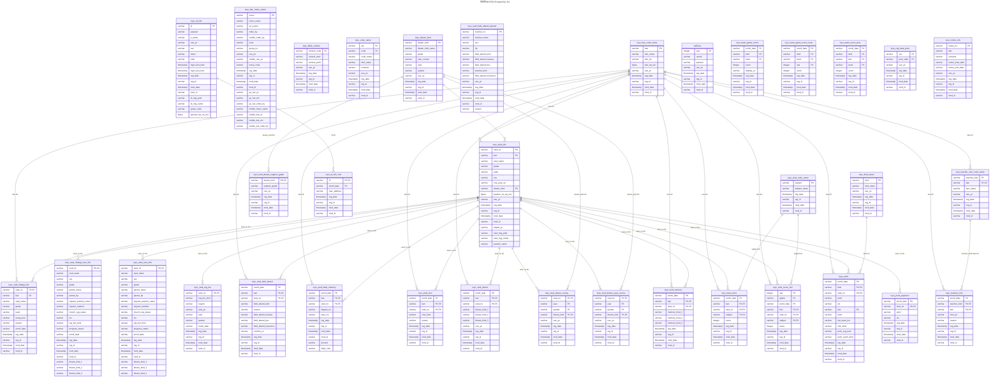

## 3-1. ERD

```mermaid
---
title: 토요하자 DB ERD (PostgreSQL 16)
---
erDiagram

    toyo_ban_code_name {
        varchar ban PK
        varchar ban_name
        varchar ban_hp
        bytea ban_hp_enc
        varchar use_yn
        timestamp reg_date
        varchar reg_id
        timestamp mod_date
        varchar mod_id
    }

    toyo_ban_menu_name {
        varchar menu PK
        varchar menu_name
        varchar src_name
        varchar order_by
        varchar mobile_order_by
        varchar level
        varchar group_no
        varchar use_yn
        varchar mobile_use_yn
        varchar menu_code
        timestamp reg_date
        varchar reg_id
        timestamp mod_date
        varchar mod_id
        varchar go_but_yn
        varchar go_but_nm
        varchar go_but_order_by
        varchar mobile_menu_name
        varchar mobile_but_yn
        varchar mobile_but_nm
        varchar mobile_but_order_by
    }

    toyo_bible_contest {
        varchar contest_code PK
        varchar contest_rank
        varchar contest_point
        varchar use_yn
        timestamp reg_date
        varchar reg_id
        timestamp mod_date
        varchar mod_id
    }

    toyo_code_name {
        varchar opt PK
        varchar code PK
        varchar code_name
        varchar kind_name
        varchar contents
        varchar use_yn
        timestamp reg_date
        varchar reg_id
        timestamp mod_date
        varchar mod_id
    }

    toyo_dream_kind {
        varchar dream_kind PK
        varchar dream_kind_name
        varchar grade
        varchar year_course
        varchar year
        varchar quarter
        varchar use_yn
        timestamp reg_date
        varchar reg_id
        timestamp mod_date
        varchar mod_id
    }

    toyo_kind_name {
        varchar kind PK
        varchar kind_name
        varchar use_yn
        timestamp reg_date
        varchar reg_id
        timestamp mod_date
        varchar mod_id
    }

    toyo_stud_code_name {
        varchar subject PK
        varchar subject_name
        timestamp reg_date
        varchar reg_id
        timestamp mod_date
        varchar mod_id
    }

    toyo_stud_dream_support_grade {
        varchar dream_kind PK,FK
        varchar support_grade
        varchar use_yn
        timestamp reg_date
        varchar reg_id
        timestamp mod_date
        varchar mod_id
    }

    toyo_stud_field_attend_teacher {
        varchar teacher_no PK
        varchar teacher_name
        varchar sex
        varchar hp
        varchar field_attend_kind
        varchar field_attend_nausea
        varchar field_attend_bus
        varchar teacher_kind
        varchar field_attend_insurance
        varchar use_yn
        timestamp reg_date
        varchar reg_id
        timestamp mod_date
        varchar mod_id
        varchar reason
    }

    toyo_teacher_chul_code_name {
        varchar teacher_kind PK
        varchar ban PK,FK
        varchar ban_name
        varchar use_yn
        timestamp reg_date
        varchar reg_id
        timestamp mod_date
        varchar mod_id
    }

    toyo_id_info {
        varchar id PK
        varchar passwd
        varchar k_name
        varchar use_yn
        varchar ssn
        varchar token
        varchar auth
        timestamp login_first_time
        timestamp login_last_time
        timestamp reg_date
        varchar reg_id
        timestamp mod_date
        varchar mod_id
        varchar id_img_path
        varchar id_img_name
        varchar group_code
        bytea teacher_hp_no_enc
    }

    md5enc {
        integer seq PK
        varchar userid
        varchar passwd
        varchar use_yn
        timestamp reg_date
        varchar reg_id
        timestamp mod_date
        varchar mod_id
    }

    toyo_id_info_hist {
        varchar id PK,FK
        varchar enroll_date PK
        varchar mac_address
        timestamp reg_date
        varchar reg_id
        timestamp mod_date
        varchar mod_id
    }

    toyo_stud_info {
        varchar stud_no PK
        varchar ban FK
        varchar stud_name
        varchar grade
        varchar team
        varchar sex
        varchar one_year_yn
        varchar dream_kind FK
        bytea parents_no_hp_enc
        varchar use_yn
        timestamp reg_date
        varchar reg_id
        timestamp mod_date
        varchar mod_id
        varchar attend_yn
        varchar stud_img_path
        varchar stud_img_name
        varchar parents_name
    }

    toyo_stud_2hakgi_info {
        varchar stud_no PK,FK
        varchar ban FK
        varchar stud_name
        varchar grade
        varchar team
        varchar rereg_kind
        varchar reason
        varchar enroll_date
        timestamp reg_date
        varchar reg_id
        timestamp mod_date
        varchar mod_id
    }

    toyo_stud_2hakgi_new_info {
        varchar stud_no PK,FK
        varchar stud_name
        varchar sex
        varchar grade
        varchar parent_name
        varchar parent_hp
        varchar request_teacher_name
        varchar request_method
        varchar church_reg_status
        varchar etc
        varchar reg_fee_kind
        varchar progress_status
        varchar enroll_date
        timestamp reg_date
        varchar reg_id
        timestamp mod_date
        varchar mod_id
        varchar dream_kind_1
        varchar dream_kind_2
        varchar dream_kind_3
    }

    toyo_stud_new_info {
        varchar stud_no PK,FK
        varchar stud_name
        varchar sex
        varchar grade
        varchar parent_name
        varchar parent_hp
        varchar request_teacher_name
        varchar request_method
        varchar church_reg_status
        varchar etc
        varchar reg_fee_kind
        varchar progress_status
        varchar enroll_date
        timestamp reg_date
        varchar reg_id
        timestamp mod_date
        varchar mod_id
        varchar dream_kind_1
        varchar dream_kind_2
        varchar dream_kind_3
    }

    toyo_stud_reg_fee {
        varchar stud_no PK,FK
        varchar reg_fee_kind
        varchar reason
        varchar new_yn
        varchar year
        varchar quarter
        varchar enroll_date
        timestamp reg_date
        varchar reg_id
        timestamp mod_date
        varchar mod_id
    }

    toyo_stud_field_attend {
        varchar enroll_date PK
        varchar ban PK,FK
        varchar stud_no PK,FK
        varchar field_attend_kind
        varchar reason
        varchar field_attend_nausea
        varchar field_attend_bus
        varchar field_attend_insurance
        varchar confirm_yn
        timestamp reg_date
        varchar reg_id
        timestamp mod_date
        varchar mod_id
    }

    toyo_stud_bible_memory {
        varchar enroll_date PK
        varchar ban PK,FK
        varchar stud_no PK,FK
        varchar degree_no
        varchar pass_no
        timestamp reg_date
        varchar reg_id
        timestamp mod_date
        varchar mod_id
        varchar present
        varchar bible_chul
    }

    toyo_stud_chul {
        varchar enroll_date PK
        varchar ban PK,FK
        varchar stud_no PK,FK
        varchar chul_kind
        varchar reason
        timestamp reg_date
        varchar reg_id
        timestamp mod_date
        varchar mod_id
    }

    toyo_stud_dream {
        varchar enroll_date PK
        varchar ban PK,FK
        varchar stud_no PK,FK
        varchar dream_kind_1
        varchar dream_kind_2
        varchar dream_kind_3
        varchar use_yn
        timestamp reg_date
        varchar reg_id
        timestamp mod_date
        varchar mod_id
    }

    toyo_stud_dream_course {
        varchar stud_no PK,FK
        varchar year PK
        varchar quarter PK
        varchar dream_kind PK,FK
        varchar use_yn
        timestamp reg_date
        varchar reg_id
        timestamp mod_date
        varchar mod_id
    }

    toyo_stud_dream_year_course {
        varchar stud_no PK,FK
        varchar year PK
        varchar quarter PK
        varchar dream_kind PK,FK
        varchar use_yn
        timestamp reg_date
        varchar reg_id
        timestamp mod_date
        varchar mod_id
    }

    toyo_stud_memory {
        varchar enroll_date PK
        varchar ban PK,FK
        varchar stud_no PK,FK
        varchar memory_kind_1
        varchar memory_kind_2
        varchar memory_kind_3
        timestamp reg_date
        varchar reg_id
        timestamp mod_date
        varchar mod_id
    }

    toyo_stud_score {
        varchar enroll_date PK
        varchar ban PK,FK
        varchar stud_no PK,FK
        varchar subject PK,FK
        integer score
        timestamp reg_date
        varchar reg_id
        timestamp mod_date
        varchar mod_id
    }

    toyo_stud_score_hist {
        integer seq PK
        varchar gubun PK
        varchar enroll_date PK
        varchar ban PK,FK
        varchar stud_no PK,FK
        varchar subject PK,FK
        integer score
        timestamp reg_date
        varchar reg_id
        timestamp mod_date
        varchar mod_id
    }

    toyo_teacher_chul {
        varchar enroll_date PK
        varchar teacher_kind PK,FK
        varchar ban PK,FK
        varchar chul_yn
        varchar reason
        timestamp reg_date
        varchar reg_id
        timestamp mod_date
        varchar mod_id
    }

    toyo_team_game_score {
        varchar enroll_date PK
        varchar kind PK
        varchar team PK
        integer score
        varchar display_yn
        timestamp reg_date
        varchar reg_id
        timestamp mod_date
        varchar mod_id
    }

    toyo_team_game_score_rows {
        varchar enroll_date PK
        varchar kind PK
        varchar team PK
        integer seq PK
        integer score
        timestamp reg_date
        varchar reg_id
        timestamp mod_date
        varchar mod_id
    }

    toyo_team_score_plus {
        varchar enroll_date PK
        varchar kind PK
        varchar ban PK
        varchar team PK
        integer score
        timestamp reg_date
        varchar reg_id
        timestamp mod_date
        varchar mod_id
    }

    toyo_point {
        varchar enroll_date PK
        varchar kind PK,FK
        varchar stud_no PK,FK
        varchar point
        varchar etc
        varchar ban FK
        varchar team
        varchar top_team_kor
        varchar chul_kind
        varchar point_reg_kind
        varchar point_event_kind
        timestamp reg_date
        varchar reg_id
        timestamp mod_date
        varchar mod_id
    }

    toyo_point_payment {
        varchar enroll_date PK
        varchar stud_no PK,FK
        varchar point
        varchar etc
        timestamp reg_date
        varchar reg_id
        timestamp mod_date
        varchar mod_id
    }

    toyo_reg_date_poss {
        varchar seq PK
        varchar poss_date PK
        varchar use_yn
        timestamp reg_date
        varchar reg_id
        timestamp mod_date
        varchar mod_id
    }

    toyo_notice_info {
        varchar notice_no PK
        varchar title
        varchar contents
        varchar notice_start_date
        varchar notice_end_date
        varchar use_yn
        timestamp reg_date
        varchar reg_id
        timestamp mod_date
        varchar mod_id
    }

    toyo_ban_code_name ||--o{ toyo_stud_info : "ban FK"
    toyo_dream_kind ||--o{ toyo_stud_info : "dream_kind FK"
    toyo_ban_code_name ||--o{ toyo_stud_2hakgi_info : "ban FK"
    toyo_stud_info ||--o{ toyo_stud_2hakgi_info : "stud_no FK"
    toyo_stud_info ||--o{ toyo_stud_2hakgi_new_info : "stud_no FK"
    toyo_stud_info ||--o{ toyo_stud_new_info : "stud_no FK"
    toyo_stud_info ||--o{ toyo_stud_reg_fee : "stud_no FK"
    toyo_ban_code_name ||--o{ toyo_stud_field_attend : "ban FK"
    toyo_stud_info ||--o{ toyo_stud_field_attend : "stud_no FK"
    toyo_ban_code_name ||--o{ toyo_stud_bible_memory : "ban FK"
    toyo_stud_info ||--o{ toyo_stud_bible_memory : "stud_no FK"
    toyo_ban_code_name ||--o{ toyo_stud_chul : "ban FK"
    toyo_stud_info ||--o{ toyo_stud_chul : "stud_no FK"
    toyo_ban_code_name ||--o{ toyo_stud_dream : "ban FK"
    toyo_stud_info ||--o{ toyo_stud_dream : "stud_no FK"
    toyo_stud_info ||--o{ toyo_stud_dream_course : "stud_no FK"
    toyo_dream_kind ||--o{ toyo_stud_dream_course : "dream_kind FK"
    toyo_stud_info ||--o{ toyo_stud_dream_year_course : "stud_no FK"
    toyo_dream_kind ||--o{ toyo_stud_dream_year_course : "dream_kind FK"
    toyo_dream_kind ||--o{ toyo_stud_dream_support_grade : "dream_kind FK"
    toyo_ban_code_name ||--o{ toyo_stud_memory : "ban FK"
    toyo_stud_info ||--o{ toyo_stud_memory : "stud_no FK"
    toyo_ban_code_name ||--o{ toyo_stud_score : "ban FK"
    toyo_stud_info ||--o{ toyo_stud_score : "stud_no FK"
    toyo_stud_code_name ||--o{ toyo_stud_score : "subject FK"
    toyo_ban_code_name ||--o{ toyo_stud_score_hist : "ban FK"
    toyo_stud_info ||--o{ toyo_stud_score_hist : "stud_no FK"
    toyo_stud_code_name ||--o{ toyo_stud_score_hist : "subject FK"
    toyo_ban_code_name ||--o{ toyo_teacher_chul : "ban FK"
    toyo_teacher_chul_code_name ||--o{ toyo_teacher_chul : "teacher_kind+ban FK"
    toyo_ban_code_name ||--o{ toyo_teacher_chul_code_name : "ban FK"
    toyo_id_info ||--o{ toyo_id_info_hist : "id FK"
    toyo_ban_code_name ||--o{ toyo_point : "ban FK"
    toyo_stud_info ||--o{ toyo_point : "stud_no FK"
    toyo_kind_name ||--o{ toyo_point : "kind FK"
    toyo_stud_info ||--o{ toyo_point_payment : "stud_no FK"
```