## 3-1. ERD (검증본)

> **검증 근거**: `toyo테이블스키마DB_덤프.sql`(원본 MySQL 5.5 덤프, toyo_ 테이블 56개) 및 PHP 소스 256개 파일 전수 대조.
>
> **⚠️ 전제 조건 (반드시 읽을 것)**
> 원본 MySQL 스키마에는 **56개 `toyo_` 테이블 전체에 PRIMARY KEY, FOREIGN KEY, 보조 INDEX가 단 하나도 선언되어 있지 않습니다.** (`md5enc` 포함) 아래 ERD의 PK/FK는 전부 PHP 소스의 실제 쿼리 패턴(WHERE 절, JOIN, 반복 저장 키)을 근거로 **역설계(reverse-engineering)한 논리적 키**이며, 원본 DB에 이미 존재하던 제약조건이 아닙니다. PostgreSQL로 마이그레이션 시 이 키들을 물리적 제약조건으로 새로 생성해야 합니다.
>
> **테이블 커버리지 검증 결과**: 원본 56개 `toyo_` 테이블 중 백업/임시 테이블 22개(날짜가 붙은 `_backup` 계열 12개, `_pack`/`_temp`/`_2017_grade` 계열 8개, 기타 2개)는 애플리케이션 코드에서 전혀 참조되지 않아 정상적으로 제외되었습니다. 나머지 34개 + `md5enc` = 35개 노드가 이 ERD의 대상이며, 이는 실사용 테이블 전체와 정확히 일치합니다(누락 없음).

```mermaid
---
title: 토요하자 DB ERD (PostgreSQL 16)
---
erDiagram

    %% ⚠️ 범용 코드마스터 테이블
    %% 코드 전체에서 OPT 컬럼값으로 최소 20개 이상 서로 다른 도메인을 조회함:
    %% CHUL_KIND, BIBLE_CHUL, DEGREE_NO, PASS_NO, PRESENT, MEMORY_KIND,
    %% FIELD_ATTEND_KIND/BUS/NAUSEA, REG_FEE_KIND, REREG_KIND, POINT_EVENT_KIND, TEAM_KIND 등
    %% EAV(OPT+CODE) 구조라 물리적 FK로 표현이 불가능하므로 관계선 대신 이 주석으로 명시함.
    %% toyo_stud_chul / toyo_stud_bible_memory / toyo_stud_memory / toyo_stud_reg_fee /
    %% toyo_stud_field_attend / toyo_point 등 대다수 트랜잭션 테이블이 이 테이블을 소프트 참조함.
    toyo_code_name {
        varchar opt PK
        varchar code PK
        varchar code_name
        varchar kind_name
        varchar contents
        varchar use_yn
        timestamp reg_date
        varchar reg_id
        timestamp mod_date
        varchar mod_id
    }

    toyo_ban_code_name {
        varchar ban PK
        varchar ban_name
        varchar ban_hp
        bytea ban_hp_enc
        varchar use_yn
        timestamp reg_date
        varchar reg_id
        timestamp mod_date
        varchar mod_id
    }

    toyo_ban_menu_name {
        varchar menu PK
        varchar menu_name
        varchar src_name
        varchar order_by
        varchar mobile_order_by
        varchar level
        varchar group_no
        varchar use_yn
        varchar mobile_use_yn
        varchar menu_code
        timestamp reg_date
        varchar reg_id
        timestamp mod_date
        varchar mod_id
        varchar go_but_yn
        varchar go_but_nm
        varchar go_but_order_by
        varchar mobile_menu_name
        varchar mobile_but_yn
        varchar mobile_but_nm
        varchar mobile_but_order_by
    }

    toyo_bible_contest {
        varchar contest_code PK
        varchar contest_rank
        varchar contest_point
        varchar use_yn
        timestamp reg_date
        varchar reg_id
        timestamp mod_date
        varchar mod_id
    }

    toyo_dream_kind {
        varchar dream_kind PK
        varchar dream_kind_name
        varchar grade
        varchar year_course
        varchar year
        varchar quarter
        varchar use_yn
        timestamp reg_date
        varchar reg_id
        timestamp mod_date
        varchar mod_id
    }

    toyo_kind_name {
        varchar kind PK
        varchar kind_name
        varchar use_yn
        timestamp reg_date
        varchar reg_id
        timestamp mod_date
        varchar mod_id
    }

    %% ⚠️ 미사용 확인: PHP 소스 256개 전체에서 이 테이블 참조 0건.
    %% toyo_stud_score.subject FK로 그려져 있으나 실제 점수 조회는 SUBJECT='001'~'004' 하드코딩.
    %% 유지/삭제 여부 고객 확인 필요.
    toyo_stud_code_name {
        varchar subject PK
        varchar subject_name
        timestamp reg_date
        varchar reg_id
        timestamp mod_date
        varchar mod_id
    }

    %% ⚠️ 미사용 확인: PHP 소스 256개 전체에서 이 테이블 참조 0건. 삭제 검토 대상.
    toyo_stud_dream_support_grade {
        varchar dream_kind PK,FK
        varchar support_grade
        varchar use_yn
        timestamp reg_date
        varchar reg_id
        timestamp mod_date
        varchar mod_id
    }

    toyo_stud_field_attend_teacher {
        varchar teacher_no PK
        varchar teacher_name
        varchar sex
        varchar hp
        varchar field_attend_kind
        varchar field_attend_nausea
        varchar field_attend_bus
        varchar teacher_kind
        varchar field_attend_insurance
        varchar use_yn
        timestamp reg_date
        varchar reg_id
        timestamp mod_date
        varchar mod_id
        varchar reason
    }

    toyo_teacher_chul_code_name {
        varchar teacher_kind PK
        varchar ban PK,FK
        varchar ban_name
        varchar use_yn
        timestamp reg_date
        varchar reg_id
        timestamp mod_date
        varchar mod_id
    }

    toyo_id_info {
        varchar id PK
        varchar passwd
        varchar k_name
        varchar use_yn
        varchar ssn
        varchar token
        varchar auth
        timestamp login_first_time
        timestamp login_last_time
        timestamp reg_date
        varchar reg_id
        timestamp mod_date
        varchar mod_id
        varchar id_img_path
        varchar id_img_name
        varchar group_code
        bytea teacher_hp_no_enc
    }

    %% ⚠️ 특수 목적 테이블: 일반 사용자 계정이 아니라 USERID='jcs1975' 하드코딩된
    %% 단일 관리자 마스터 비밀번호 검증용 게이트 (banTeamModifyProc.php, menuManagerModifyProc.php).
    %% 다른 테이블과 FK 관계가 없는 것이 정상이며, 원본에 PK가 없어 seq를 논리 PK로 승격함.
    md5enc {
        integer seq PK
        varchar userid
        varchar passwd
        varchar use_yn
        timestamp reg_date
        varchar reg_id
        timestamp mod_date
        varchar mod_id
    }

    toyo_id_info_hist {
        varchar id PK,FK
        varchar enroll_date PK
        varchar mac_address
        timestamp reg_date
        varchar reg_id
        timestamp mod_date
        varchar mod_id
    }

    toyo_stud_info {
        varchar stud_no PK
        varchar ban FK
        varchar stud_name
        varchar grade
        varchar team
        varchar sex
        varchar one_year_yn
        varchar dream_kind FK
        bytea parents_no_hp_enc
        varchar use_yn
        timestamp reg_date
        varchar reg_id
        timestamp mod_date
        varchar mod_id
        varchar attend_yn
        varchar stud_img_path
        varchar stud_img_name
        varchar parents_name
    }

    toyo_stud_2hakgi_info {
        varchar stud_no PK,FK
        varchar ban FK
        varchar stud_name
        varchar grade
        varchar team
        varchar rereg_kind
        varchar reason
        varchar enroll_date
        timestamp reg_date
        varchar reg_id
        timestamp mod_date
        varchar mod_id
    }

    %% 비고: dream_kind_1/2/3 은 원본이 반복 컬럼(비정규화)으로 되어 있어 FK로 표현 불가.
    %% toyo_dream_kind.dream_kind 값을 3개 컬럼에 나눠 저장하는 1NF 위반 구조. 재정규화 검토 권장.
    toyo_stud_2hakgi_new_info {
        varchar stud_no PK,FK
        varchar stud_name
        varchar sex
        varchar grade
        varchar parent_name
        varchar parent_hp
        varchar request_teacher_name
        varchar request_method
        varchar church_reg_status
        varchar etc
        varchar reg_fee_kind
        varchar progress_status
        varchar enroll_date
        timestamp reg_date
        varchar reg_id
        timestamp mod_date
        varchar mod_id
        varchar dream_kind_1
        varchar dream_kind_2
        varchar dream_kind_3
    }

    toyo_stud_new_info {
        varchar stud_no PK,FK
        varchar stud_name
        varchar sex
        varchar grade
        varchar parent_name
        varchar parent_hp
        varchar request_teacher_name
        varchar request_method
        varchar church_reg_status
        varchar etc
        varchar reg_fee_kind
        varchar progress_status
        varchar enroll_date
        timestamp reg_date
        varchar reg_id
        timestamp mod_date
        varchar mod_id
        varchar dream_kind_1
        varchar dream_kind_2
        varchar dream_kind_3
    }

    toyo_stud_reg_fee {
        varchar stud_no PK,FK
        varchar reg_fee_kind
        varchar reason
        varchar new_yn
        varchar year
        varchar quarter
        varchar enroll_date
        timestamp reg_date
        varchar reg_id
        timestamp mod_date
        varchar mod_id
    }

    toyo_stud_field_attend {
        varchar enroll_date PK
        varchar ban PK,FK
        varchar stud_no PK,FK
        varchar field_attend_kind
        varchar reason
        varchar field_attend_nausea
        varchar field_attend_bus
        varchar field_attend_insurance
        varchar confirm_yn
        timestamp reg_date
        varchar reg_id
        timestamp mod_date
        varchar mod_id
    }

    toyo_stud_bible_memory {
        varchar enroll_date PK
        varchar ban PK,FK
        varchar stud_no PK,FK
        varchar degree_no
        varchar pass_no
        timestamp reg_date
        varchar reg_id
        timestamp mod_date
        varchar mod_id
        varchar present
        varchar bible_chul
    }

    toyo_stud_chul {
        varchar enroll_date PK
        varchar ban PK,FK
        varchar stud_no PK,FK
        varchar chul_kind
        varchar reason
        timestamp reg_date
        varchar reg_id
        timestamp mod_date
        varchar mod_id
    }

    toyo_stud_dream {
        varchar enroll_date PK
        varchar ban PK,FK
        varchar stud_no PK,FK
        varchar dream_kind_1
        varchar dream_kind_2
        varchar dream_kind_3
        varchar use_yn
        timestamp reg_date
        varchar reg_id
        timestamp mod_date
        varchar mod_id
    }

    %% ⚠️ 미사용 확인: toyo_stud_dream_year_course와 컬럼 구성이 완전히 동일한 중복 테이블.
    %% PHP 소스 256개 전체에서 두 테이블 다 참조 0건. 통합 또는 삭제 검토 필요.
    toyo_stud_dream_course {
        varchar stud_no PK,FK
        varchar year PK
        varchar quarter PK
        varchar dream_kind PK,FK
        varchar use_yn
        timestamp reg_date
        varchar reg_id
        timestamp mod_date
        varchar mod_id
    }

    %% ⚠️ 미사용 확인: toyo_stud_dream_course와 컬럼 구성이 완전히 동일한 중복 테이블.
    %% PHP 소스 256개 전체에서 두 테이블 다 참조 0건. 통합 또는 삭제 검토 필요.
    toyo_stud_dream_year_course {
        varchar stud_no PK,FK
        varchar year PK
        varchar quarter PK
        varchar dream_kind PK,FK
        varchar use_yn
        timestamp reg_date
        varchar reg_id
        timestamp mod_date
        varchar mod_id
    }

    toyo_stud_memory {
        varchar enroll_date PK
        varchar ban PK,FK
        varchar stud_no PK,FK
        varchar memory_kind_1
        varchar memory_kind_2
        varchar memory_kind_3
        timestamp reg_date
        varchar reg_id
        timestamp mod_date
        varchar mod_id
    }

    toyo_stud_score {
        varchar enroll_date PK
        varchar ban PK,FK
        varchar stud_no PK,FK
        varchar subject PK,FK
        integer score
        timestamp reg_date
        varchar reg_id
        timestamp mod_date
        varchar mod_id
    }

    %% ⚠️ 미사용 확인: PHP 소스 256개 전체에서 이 테이블 참조 0건 (INSERT/SELECT 모두 없음).
    %% 이력 적재 로직이 DB 트리거 등 이 코드셋 밖에 존재하는지 확인 필요.
    toyo_stud_score_hist {
        integer seq PK
        varchar gubun PK
        varchar enroll_date PK
        varchar ban PK,FK
        varchar stud_no PK,FK
        varchar subject PK,FK
        integer score
        timestamp reg_date
        varchar reg_id
        timestamp mod_date
        varchar mod_id
    }

    toyo_teacher_chul {
        varchar enroll_date PK
        varchar teacher_kind PK,FK
        varchar ban PK,FK
        varchar chul_yn
        varchar reason
        timestamp reg_date
        varchar reg_id
        timestamp mod_date
        varchar mod_id
    }

    toyo_team_game_score {
        varchar enroll_date PK
        varchar kind PK
        varchar team PK
        integer score
        varchar display_yn
        timestamp reg_date
        varchar reg_id
        timestamp mod_date
        varchar mod_id
    }

    toyo_team_game_score_rows {
        varchar enroll_date PK
        varchar kind PK
        varchar team PK
        integer seq PK
        integer score
        timestamp reg_date
        varchar reg_id
        timestamp mod_date
        varchar mod_id
    }

    toyo_team_score_plus {
        varchar enroll_date PK
        varchar kind PK
        varchar ban PK
        varchar team PK
        integer score
        timestamp reg_date
        varchar reg_id
        timestamp mod_date
        varchar mod_id
    }

    toyo_point {
        varchar enroll_date PK
        varchar kind PK,FK
        varchar stud_no PK,FK
        varchar point
        varchar etc
        varchar ban FK
        varchar team
        varchar top_team_kor
        varchar chul_kind
        varchar point_reg_kind
        varchar point_event_kind
        timestamp reg_date
        varchar reg_id
        timestamp mod_date
        varchar mod_id
    }

    toyo_point_payment {
        varchar enroll_date PK
        varchar stud_no PK,FK
        varchar point
        varchar etc
        timestamp reg_date
        varchar reg_id
        timestamp mod_date
        varchar mod_id
    }

    toyo_reg_date_poss {
        varchar seq PK
        varchar poss_date PK
        varchar use_yn
        timestamp reg_date
        varchar reg_id
        timestamp mod_date
        varchar mod_id
    }

    toyo_notice_info {
        varchar notice_no PK
        varchar title
        varchar contents
        varchar notice_start_date
        varchar notice_end_date
        varchar use_yn
        timestamp reg_date
        varchar reg_id
        timestamp mod_date
        varchar mod_id
    }

    toyo_ban_code_name ||--o{ toyo_stud_info : "ban FK"
    toyo_dream_kind ||--o{ toyo_stud_info : "dream_kind FK"
    toyo_ban_code_name ||--o{ toyo_stud_2hakgi_info : "ban FK"
    toyo_stud_info ||--o{ toyo_stud_2hakgi_info : "stud_no FK"
    toyo_stud_info ||--o{ toyo_stud_2hakgi_new_info : "stud_no FK"
    toyo_stud_info ||--o{ toyo_stud_new_info : "stud_no FK"
    toyo_stud_info ||--o{ toyo_stud_reg_fee : "stud_no FK"
    toyo_ban_code_name ||--o{ toyo_stud_field_attend : "ban FK"
    toyo_stud_info ||--o{ toyo_stud_field_attend : "stud_no FK"
    toyo_ban_code_name ||--o{ toyo_stud_bible_memory : "ban FK"
    toyo_stud_info ||--o{ toyo_stud_bible_memory : "stud_no FK"
    toyo_ban_code_name ||--o{ toyo_stud_chul : "ban FK"
    toyo_stud_info ||--o{ toyo_stud_chul : "stud_no FK"
    toyo_ban_code_name ||--o{ toyo_stud_dream : "ban FK"
    toyo_stud_info ||--o{ toyo_stud_dream : "stud_no FK"
    toyo_stud_info ||--o{ toyo_stud_dream_course : "stud_no FK"
    toyo_dream_kind ||--o{ toyo_stud_dream_course : "dream_kind FK"
    toyo_stud_info ||--o{ toyo_stud_dream_year_course : "stud_no FK"
    toyo_dream_kind ||--o{ toyo_stud_dream_year_course : "dream_kind FK"
    toyo_dream_kind ||--o{ toyo_stud_dream_support_grade : "dream_kind FK"
    toyo_ban_code_name ||--o{ toyo_stud_memory : "ban FK"
    toyo_stud_info ||--o{ toyo_stud_memory : "stud_no FK"
    toyo_ban_code_name ||--o{ toyo_stud_score : "ban FK"
    toyo_stud_info ||--o{ toyo_stud_score : "stud_no FK"
    toyo_stud_code_name ||--o{ toyo_stud_score : "subject FK"
    toyo_ban_code_name ||--o{ toyo_stud_score_hist : "ban FK"
    toyo_stud_info ||--o{ toyo_stud_score_hist : "stud_no FK"
    toyo_stud_code_name ||--o{ toyo_stud_score_hist : "subject FK"
    toyo_ban_code_name ||--o{ toyo_teacher_chul : "ban FK"
    toyo_teacher_chul_code_name ||--o{ toyo_teacher_chul : "teacher_kind+ban FK"
    toyo_ban_code_name ||--o{ toyo_teacher_chul_code_name : "ban FK"
    toyo_id_info ||--o{ toyo_id_info_hist : "id FK"
    toyo_ban_code_name ||--o{ toyo_point : "ban FK"
    toyo_stud_info ||--o{ toyo_point : "stud_no FK"
    toyo_kind_name ||--o{ toyo_point : "kind FK"
    toyo_stud_info ||--o{ toyo_point_payment : "stud_no FK"
```

---

## 검증 요약표

| 구분 | 내용 | 조치 |
|---|---|---|
| 테이블 커버리지 | 원본 56개 중 실사용 34개 + md5enc, 100% 일치 | 변경 없음 |
| PK/FK 전제 | 원본에 PK/FK/INDEX 전무 → ERD는 역설계 결과 | 상단 각주 추가 |
| `toyo_code_name` | 20개+ 컬럼의 소프트 참조 마스터인데 고립 노드 | 주석으로 관계 명시 |
| `toyo_stud_code_name` | 코드 미사용 (0건) | ⚠️ 플래그, 유지여부 확인 |
| `toyo_stud_dream_support_grade` | 코드 미사용 (0건) | ⚠️ 플래그, 유지여부 확인 |
| `toyo_stud_score_hist` | 코드 미사용 (0건) | ⚠️ 플래그, 유지여부 확인 |
| `toyo_stud_dream_course` / `_year_course` | 완전 동일 구조 중복, 둘 다 미사용 | ⚠️ 통합/삭제 검토 |
| `md5enc` | 하드코딩 관리자 인증 게이트, 원본 PK 없음 | 특수목적 주석 추가 |
| `dream_kind_1/2/3` 반복 컬럼 | 1NF 위반 (비정규화) | 비고 추가, FK 표현 불가 사유 명시 |
| `_ENC` 컬럼 암호화 방식 | `AES_ENCRYPT` + DB 루트 비번 재사용 | 별도 문서에 pgcrypto 전환 계획 필요 (ERD 범위 밖) |
