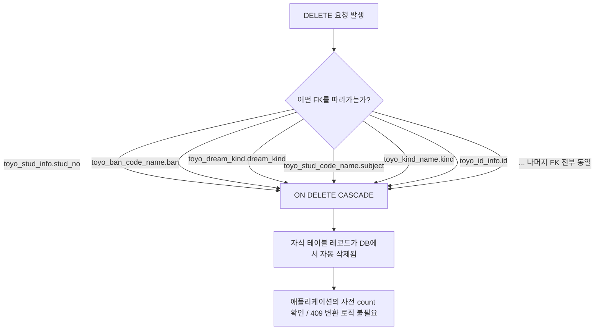

## 3-2. DDL

```sql
-- ============================================
-- 토요하자 DB DDL (PostgreSQL 16)
-- 기준: 운영 서버 SQL 덤프(toyo테이블스키마.sql)
-- 제외: 백업/임시/pack/날짜suffix 테이블, MySQL 시스템 테이블
-- 정책: 모든 FK는 ON DELETE CASCADE, REG_DATE/MOD_DATE는 TIMESTAMP로 통일
-- ============================================

CREATE TABLE toyo_ban_code_name (
    ban VARCHAR(3),
    ban_name VARCHAR(100),
    ban_hp VARCHAR(100),
    ban_hp_enc BYTEA,
    use_yn VARCHAR(1),
    reg_date TIMESTAMP,
    reg_id VARCHAR(30),
    mod_date TIMESTAMP,
    mod_id VARCHAR(30),
    CONSTRAINT pk_toyo_ban_code_name PRIMARY KEY (ban)
);

CREATE TABLE toyo_ban_menu_name (
    menu VARCHAR(2),
    menu_name VARCHAR(100),
    src_name VARCHAR(100),
    order_by VARCHAR(2),
    mobile_order_by VARCHAR(2),
    level VARCHAR(1),
    group_no VARCHAR(2),
    use_yn VARCHAR(1),
    mobile_use_yn VARCHAR(1),
    menu_code VARCHAR(2),
    reg_date TIMESTAMP,
    reg_id VARCHAR(30),
    mod_date TIMESTAMP,
    mod_id VARCHAR(30),
    go_but_yn VARCHAR(1),
    go_but_nm VARCHAR(20),
    go_but_order_by VARCHAR(2),
    mobile_menu_name VARCHAR(100),
    mobile_but_yn VARCHAR(1),
    mobile_but_nm VARCHAR(20),
    mobile_but_order_by VARCHAR(2),
    CONSTRAINT pk_toyo_ban_menu_name PRIMARY KEY (menu)
);

CREATE TABLE toyo_bible_contest (
    contest_code VARCHAR(3),
    contest_rank VARCHAR(3),
    contest_point VARCHAR(3),
    use_yn VARCHAR(1),
    reg_date TIMESTAMP,
    reg_id VARCHAR(30),
    mod_date TIMESTAMP,
    mod_id VARCHAR(30),
    CONSTRAINT pk_toyo_bible_contest PRIMARY KEY (contest_code)
);

CREATE TABLE toyo_code_name (
    opt VARCHAR(20),
    code VARCHAR(6),
    code_name VARCHAR(100),
    kind_name VARCHAR(200),
    contents VARCHAR(4000),
    use_yn VARCHAR(1),
    reg_date TIMESTAMP,
    reg_id VARCHAR(30),
    mod_date TIMESTAMP,
    mod_id VARCHAR(30),
    CONSTRAINT pk_toyo_code_name PRIMARY KEY (opt, code)
);

CREATE TABLE toyo_dream_kind (
    dream_kind VARCHAR(3),
    dream_kind_name VARCHAR(100),
    grade VARCHAR(10),
    year_course VARCHAR(1),
    year VARCHAR(4),
    quarter VARCHAR(1),
    use_yn VARCHAR(1),
    reg_date TIMESTAMP,
    reg_id VARCHAR(30),
    mod_date TIMESTAMP,
    mod_id VARCHAR(30),
    CONSTRAINT pk_toyo_dream_kind PRIMARY KEY (dream_kind)
);

CREATE TABLE toyo_kind_name (
    kind VARCHAR(2),
    kind_name VARCHAR(100),
    use_yn VARCHAR(1),
    reg_date TIMESTAMP,
    reg_id VARCHAR(30),
    mod_date TIMESTAMP,
    mod_id VARCHAR(30),
    CONSTRAINT pk_toyo_kind_name PRIMARY KEY (kind)
);

CREATE TABLE toyo_stud_code_name (
    subject VARCHAR(3),
    subject_name VARCHAR(100),
    reg_date TIMESTAMP,
    reg_id VARCHAR(30),
    mod_date TIMESTAMP,
    mod_id VARCHAR(30),
    CONSTRAINT pk_toyo_stud_code_name PRIMARY KEY (subject)
);

CREATE TABLE toyo_stud_dream_support_grade (
    dream_kind VARCHAR(3),
    support_grade VARCHAR(6),
    use_yn VARCHAR(1),
    reg_date TIMESTAMP,
    reg_id VARCHAR(30),
    mod_date TIMESTAMP,
    mod_id VARCHAR(30),
    CONSTRAINT pk_toyo_stud_dream_support_grade PRIMARY KEY (dream_kind)
);

CREATE TABLE toyo_stud_field_attend_teacher (
    teacher_no VARCHAR(5),
    teacher_name VARCHAR(100),
    sex VARCHAR(1),
    hp VARCHAR(11),
    field_attend_kind VARCHAR(2),
    field_attend_nausea VARCHAR(2),
    field_attend_bus VARCHAR(2),
    teacher_kind VARCHAR(2),
    field_attend_insurance VARCHAR(2),
    use_yn VARCHAR(1),
    reg_date TIMESTAMP,
    reg_id VARCHAR(30),
    mod_date TIMESTAMP,
    mod_id VARCHAR(30),
    reason VARCHAR(200),
    CONSTRAINT pk_toyo_stud_field_attend_teacher PRIMARY KEY (teacher_no)
);

CREATE TABLE toyo_teacher_chul_code_name (
    teacher_kind VARCHAR(2),
    ban VARCHAR(3),
    ban_name VARCHAR(100),
    use_yn VARCHAR(1),
    reg_date TIMESTAMP,
    reg_id VARCHAR(30),
    mod_date TIMESTAMP,
    mod_id VARCHAR(30),
    CONSTRAINT pk_toyo_teacher_chul_code_name PRIMARY KEY (teacher_kind, ban)
);

CREATE TABLE toyo_id_info (
    id VARCHAR(20),
    passwd VARCHAR(64) NOT NULL,
    k_name VARCHAR(64) NOT NULL,
    use_yn VARCHAR(1),
    ssn VARCHAR(4),
    token VARCHAR(200),
    auth VARCHAR(2),
    login_first_time TIMESTAMP,
    login_last_time TIMESTAMP,
    reg_date TIMESTAMP,
    reg_id VARCHAR(30),
    mod_date TIMESTAMP,
    mod_id VARCHAR(30),
    id_img_path VARCHAR(200),
    id_img_name VARCHAR(200),
    group_code VARCHAR(2),
    teacher_hp_no_enc BYTEA,
    CONSTRAINT pk_toyo_id_info PRIMARY KEY (id)
);

CREATE TABLE md5enc (
    seq INTEGER,
    userid VARCHAR(20) NOT NULL,
    passwd VARCHAR(32) NOT NULL,
    use_yn VARCHAR(1),
    reg_date TIMESTAMP,
    reg_id VARCHAR(30),
    mod_date TIMESTAMP,
    mod_id VARCHAR(30),
    CONSTRAINT pk_md5enc PRIMARY KEY (seq)
);

CREATE TABLE toyo_id_info_hist (
    id VARCHAR(20),
    enroll_date VARCHAR(8),
    mac_address VARCHAR(100),
    reg_date TIMESTAMP,
    reg_id VARCHAR(30),
    mod_date TIMESTAMP,
    mod_id VARCHAR(30),
    CONSTRAINT pk_toyo_id_info_hist PRIMARY KEY (id, enroll_date)
);

CREATE TABLE toyo_stud_info (
    stud_no VARCHAR(5),
    ban VARCHAR(3),
    stud_name VARCHAR(100),
    grade VARCHAR(1),
    team VARCHAR(20),
    sex VARCHAR(1),
    one_year_yn VARCHAR(1),
    dream_kind VARCHAR(3),
    parents_no_hp_enc BYTEA,
    use_yn VARCHAR(1),
    reg_date TIMESTAMP,
    reg_id VARCHAR(30),
    mod_date TIMESTAMP,
    mod_id VARCHAR(30),
    attend_yn VARCHAR(1),
    stud_img_path VARCHAR(200),
    stud_img_name VARCHAR(200),
    parents_name VARCHAR(20),
    CONSTRAINT pk_toyo_stud_info PRIMARY KEY (stud_no)
);

CREATE TABLE toyo_stud_2hakgi_info (
    stud_no VARCHAR(5),
    ban VARCHAR(3),
    stud_name VARCHAR(100),
    grade VARCHAR(1),
    team VARCHAR(20),
    rereg_kind VARCHAR(2),
    reason VARCHAR(200),
    enroll_date VARCHAR(8),
    reg_date TIMESTAMP,
    reg_id VARCHAR(30),
    mod_date TIMESTAMP,
    mod_id VARCHAR(30),
    CONSTRAINT pk_toyo_stud_2hakgi_info PRIMARY KEY (stud_no)
);

CREATE TABLE toyo_stud_2hakgi_new_info (
    stud_no VARCHAR(5),
    stud_name VARCHAR(100),
    sex VARCHAR(1),
    grade VARCHAR(1),
    parent_name VARCHAR(20),
    parent_hp VARCHAR(11),
    request_teacher_name VARCHAR(20),
    request_method VARCHAR(100),
    church_reg_status VARCHAR(3),
    etc VARCHAR(400),
    reg_fee_kind VARCHAR(2),
    progress_status VARCHAR(3),
    enroll_date VARCHAR(8),
    reg_date TIMESTAMP,
    reg_id VARCHAR(30),
    mod_date TIMESTAMP,
    mod_id VARCHAR(30),
    dream_kind_1 VARCHAR(3),
    dream_kind_2 VARCHAR(3),
    dream_kind_3 VARCHAR(3),
    CONSTRAINT pk_toyo_stud_2hakgi_new_info PRIMARY KEY (stud_no)
);

CREATE TABLE toyo_stud_new_info (
    stud_no VARCHAR(5),
    stud_name VARCHAR(100),
    sex VARCHAR(1),
    grade VARCHAR(1),
    parent_name VARCHAR(20),
    parent_hp VARCHAR(11),
    request_teacher_name VARCHAR(20),
    request_method VARCHAR(100),
    church_reg_status VARCHAR(3),
    etc VARCHAR(400),
    reg_fee_kind VARCHAR(2),
    progress_status VARCHAR(3),
    enroll_date VARCHAR(8),
    reg_date TIMESTAMP,
    reg_id VARCHAR(30),
    mod_date TIMESTAMP,
    mod_id VARCHAR(30),
    dream_kind_1 VARCHAR(3),
    dream_kind_2 VARCHAR(3),
    dream_kind_3 VARCHAR(3),
    CONSTRAINT pk_toyo_stud_new_info PRIMARY KEY (stud_no)
);

CREATE TABLE toyo_stud_reg_fee (
    stud_no VARCHAR(5),
    reg_fee_kind VARCHAR(2),
    reason VARCHAR(200),
    new_yn VARCHAR(1),
    year VARCHAR(4),
    quarter VARCHAR(1),
    enroll_date VARCHAR(8),
    reg_date TIMESTAMP,
    reg_id VARCHAR(30),
    mod_date TIMESTAMP,
    mod_id VARCHAR(30),
    CONSTRAINT pk_toyo_stud_reg_fee PRIMARY KEY (stud_no)
);

CREATE TABLE toyo_stud_field_attend (
    enroll_date VARCHAR(8),
    ban VARCHAR(3),
    stud_no VARCHAR(5),
    field_attend_kind VARCHAR(2),
    reason VARCHAR(200),
    field_attend_nausea VARCHAR(2),
    field_attend_bus VARCHAR(2),
    field_attend_insurance VARCHAR(2) NOT NULL,
    confirm_yn VARCHAR(1),
    reg_date TIMESTAMP,
    reg_id VARCHAR(30),
    mod_date TIMESTAMP,
    mod_id VARCHAR(30),
    CONSTRAINT pk_toyo_stud_field_attend PRIMARY KEY (enroll_date, ban, stud_no)
);

CREATE TABLE toyo_stud_bible_memory (
    enroll_date VARCHAR(8),
    ban VARCHAR(3),
    stud_no VARCHAR(5),
    degree_no VARCHAR(2),
    pass_no VARCHAR(2),
    reg_date TIMESTAMP,
    reg_id VARCHAR(30),
    mod_date TIMESTAMP,
    mod_id VARCHAR(30),
    present VARCHAR(3),
    bible_chul VARCHAR(2),
    CONSTRAINT pk_toyo_stud_bible_memory PRIMARY KEY (enroll_date, ban, stud_no)
);

CREATE TABLE toyo_stud_chul (
    enroll_date VARCHAR(8),
    ban VARCHAR(3),
    stud_no VARCHAR(5),
    chul_kind VARCHAR(2),
    reason VARCHAR(200),
    reg_date TIMESTAMP,
    reg_id VARCHAR(30),
    mod_date TIMESTAMP,
    mod_id VARCHAR(30),
    CONSTRAINT pk_toyo_stud_chul PRIMARY KEY (enroll_date, ban, stud_no)
);

CREATE TABLE toyo_stud_dream (
    enroll_date VARCHAR(8),
    ban VARCHAR(3),
    stud_no VARCHAR(5),
    dream_kind_1 VARCHAR(3),
    dream_kind_2 VARCHAR(3),
    dream_kind_3 VARCHAR(3),
    use_yn VARCHAR(1),
    reg_date TIMESTAMP,
    reg_id VARCHAR(30),
    mod_date TIMESTAMP,
    mod_id VARCHAR(30),
    CONSTRAINT pk_toyo_stud_dream PRIMARY KEY (enroll_date, ban, stud_no)
);

CREATE TABLE toyo_stud_dream_course (
    stud_no VARCHAR(5),
    year VARCHAR(4),
    quarter VARCHAR(1),
    dream_kind VARCHAR(3),
    use_yn VARCHAR(1),
    reg_date TIMESTAMP,
    reg_id VARCHAR(30),
    mod_date TIMESTAMP,
    mod_id VARCHAR(30),
    CONSTRAINT pk_toyo_stud_dream_course PRIMARY KEY (stud_no, year, quarter, dream_kind)
);

CREATE TABLE toyo_stud_dream_year_course (
    stud_no VARCHAR(5),
    year VARCHAR(4),
    quarter VARCHAR(1),
    dream_kind VARCHAR(3),
    use_yn VARCHAR(1),
    reg_date TIMESTAMP,
    reg_id VARCHAR(30),
    mod_date TIMESTAMP,
    mod_id VARCHAR(30),
    CONSTRAINT pk_toyo_stud_dream_year_course PRIMARY KEY (stud_no, year, quarter, dream_kind)
);

CREATE TABLE toyo_stud_memory (
    enroll_date VARCHAR(8),
    ban VARCHAR(3),
    stud_no VARCHAR(5),
    memory_kind_1 VARCHAR(3),
    memory_kind_2 VARCHAR(3),
    memory_kind_3 VARCHAR(3),
    reg_date TIMESTAMP,
    reg_id VARCHAR(30),
    mod_date TIMESTAMP,
    mod_id VARCHAR(30),
    CONSTRAINT pk_toyo_stud_memory PRIMARY KEY (enroll_date, ban, stud_no)
);

CREATE TABLE toyo_stud_score (
    enroll_date VARCHAR(8),
    ban VARCHAR(3),
    stud_no VARCHAR(5),
    subject VARCHAR(3),
    score INTEGER,
    reg_date TIMESTAMP,
    reg_id VARCHAR(30),
    mod_date TIMESTAMP,
    mod_id VARCHAR(30),
    CONSTRAINT pk_toyo_stud_score PRIMARY KEY (enroll_date, ban, stud_no, subject)
);

CREATE TABLE toyo_stud_score_hist (
    seq INTEGER GENERATED BY DEFAULT AS IDENTITY,
    gubun VARCHAR(1),
    enroll_date VARCHAR(8),
    ban VARCHAR(3),
    stud_no VARCHAR(5),
    subject VARCHAR(3),
    score INTEGER,
    reg_date TIMESTAMP,
    reg_id VARCHAR(30),
    mod_date TIMESTAMP,
    mod_id VARCHAR(30),
    CONSTRAINT pk_toyo_stud_score_hist PRIMARY KEY (seq, gubun, enroll_date, ban, stud_no, subject)
);

CREATE TABLE toyo_teacher_chul (
    enroll_date VARCHAR(8),
    teacher_kind VARCHAR(2),
    ban VARCHAR(3),
    chul_yn VARCHAR(1),
    reason VARCHAR(200),
    reg_date TIMESTAMP,
    reg_id VARCHAR(30),
    mod_date TIMESTAMP,
    mod_id VARCHAR(30),
    CONSTRAINT pk_toyo_teacher_chul PRIMARY KEY (enroll_date, teacher_kind, ban)
);

CREATE TABLE toyo_team_game_score (
    enroll_date VARCHAR(8),
    kind VARCHAR(20),
    team VARCHAR(20),
    score INTEGER,
    display_yn VARCHAR(100),
    reg_date TIMESTAMP,
    reg_id VARCHAR(30),
    mod_date TIMESTAMP,
    mod_id VARCHAR(30),
    CONSTRAINT pk_toyo_team_game_score PRIMARY KEY (enroll_date, kind, team)
);

CREATE TABLE toyo_team_game_score_rows (
    enroll_date VARCHAR(8),
    kind VARCHAR(20),
    team VARCHAR(20),
    seq INTEGER,
    score INTEGER,
    reg_date TIMESTAMP,
    reg_id VARCHAR(30),
    mod_date TIMESTAMP,
    mod_id VARCHAR(30),
    CONSTRAINT pk_toyo_team_game_score_rows PRIMARY KEY (enroll_date, kind, team, seq)
);

CREATE TABLE toyo_team_score_plus (
    enroll_date VARCHAR(8),
    kind VARCHAR(20),
    ban VARCHAR(20),
    team VARCHAR(20),
    score INTEGER,
    reg_date TIMESTAMP,
    reg_id VARCHAR(30),
    mod_date TIMESTAMP,
    mod_id VARCHAR(30),
    CONSTRAINT pk_toyo_team_score_plus PRIMARY KEY (enroll_date, kind, ban, team)
);

CREATE TABLE toyo_point (
    enroll_date VARCHAR(8),
    kind VARCHAR(2),
    stud_no VARCHAR(5),
    point VARCHAR(3),
    etc VARCHAR(400),
    ban VARCHAR(3),
    team VARCHAR(20),
    top_team_kor VARCHAR(400),
    chul_kind VARCHAR(2),
    point_reg_kind VARCHAR(2),
    point_event_kind VARCHAR(2),
    reg_date TIMESTAMP,
    reg_id VARCHAR(30),
    mod_date TIMESTAMP,
    mod_id VARCHAR(30),
    CONSTRAINT pk_toyo_point PRIMARY KEY (enroll_date, kind, stud_no)
);

CREATE TABLE toyo_point_payment (
    enroll_date VARCHAR(8),
    stud_no VARCHAR(5),
    point VARCHAR(3),
    etc VARCHAR(400),
    reg_date TIMESTAMP,
    reg_id VARCHAR(30),
    mod_date TIMESTAMP,
    mod_id VARCHAR(30),
    CONSTRAINT pk_toyo_point_payment PRIMARY KEY (enroll_date, stud_no)
);

CREATE TABLE toyo_reg_date_poss (
    seq VARCHAR(3),
    poss_date VARCHAR(8),
    use_yn VARCHAR(1),
    reg_date TIMESTAMP,
    reg_id VARCHAR(30),
    mod_date TIMESTAMP,
    mod_id VARCHAR(30),
    CONSTRAINT pk_toyo_reg_date_poss PRIMARY KEY (seq, poss_date)
);

CREATE TABLE toyo_notice_info (
    notice_no VARCHAR(5),
    title VARCHAR(200) NOT NULL,
    contents VARCHAR(4000) NOT NULL,
    notice_start_date VARCHAR(8),
    notice_end_date VARCHAR(8),
    use_yn VARCHAR(1),
    reg_date TIMESTAMP,
    reg_id VARCHAR(30),
    mod_date TIMESTAMP,
    mod_id VARCHAR(30),
    CONSTRAINT pk_toyo_notice_info PRIMARY KEY (notice_no)
);

-- ============================================
-- Foreign Key 제약 (모두 ON DELETE CASCADE)
-- ============================================

ALTER TABLE toyo_stud_info ADD CONSTRAINT fk_toyo_stud_info_ban FOREIGN KEY (ban) REFERENCES toyo_ban_code_name (ban) ON DELETE CASCADE;
ALTER TABLE toyo_stud_info ADD CONSTRAINT fk_toyo_stud_info_dream_kind FOREIGN KEY (dream_kind) REFERENCES toyo_dream_kind (dream_kind) ON DELETE CASCADE;
ALTER TABLE toyo_stud_2hakgi_info ADD CONSTRAINT fk_toyo_stud_2hakgi_info_ban FOREIGN KEY (ban) REFERENCES toyo_ban_code_name (ban) ON DELETE CASCADE;
ALTER TABLE toyo_stud_2hakgi_info ADD CONSTRAINT fk_toyo_stud_2hakgi_info_stud_no FOREIGN KEY (stud_no) REFERENCES toyo_stud_info (stud_no) ON DELETE CASCADE;
ALTER TABLE toyo_stud_2hakgi_new_info ADD CONSTRAINT fk_toyo_stud_2hakgi_new_info_stud_no FOREIGN KEY (stud_no) REFERENCES toyo_stud_info (stud_no) ON DELETE CASCADE;
ALTER TABLE toyo_stud_new_info ADD CONSTRAINT fk_toyo_stud_new_info_stud_no FOREIGN KEY (stud_no) REFERENCES toyo_stud_info (stud_no) ON DELETE CASCADE;
ALTER TABLE toyo_stud_reg_fee ADD CONSTRAINT fk_toyo_stud_reg_fee_stud_no FOREIGN KEY (stud_no) REFERENCES toyo_stud_info (stud_no) ON DELETE CASCADE;
ALTER TABLE toyo_stud_field_attend ADD CONSTRAINT fk_toyo_stud_field_attend_ban FOREIGN KEY (ban) REFERENCES toyo_ban_code_name (ban) ON DELETE CASCADE;
ALTER TABLE toyo_stud_field_attend ADD CONSTRAINT fk_toyo_stud_field_attend_stud_no FOREIGN KEY (stud_no) REFERENCES toyo_stud_info (stud_no) ON DELETE CASCADE;
ALTER TABLE toyo_stud_bible_memory ADD CONSTRAINT fk_toyo_stud_bible_memory_ban FOREIGN KEY (ban) REFERENCES toyo_ban_code_name (ban) ON DELETE CASCADE;
ALTER TABLE toyo_stud_bible_memory ADD CONSTRAINT fk_toyo_stud_bible_memory_stud_no FOREIGN KEY (stud_no) REFERENCES toyo_stud_info (stud_no) ON DELETE CASCADE;
ALTER TABLE toyo_stud_chul ADD CONSTRAINT fk_toyo_stud_chul_ban FOREIGN KEY (ban) REFERENCES toyo_ban_code_name (ban) ON DELETE CASCADE;
ALTER TABLE toyo_stud_chul ADD CONSTRAINT fk_toyo_stud_chul_stud_no FOREIGN KEY (stud_no) REFERENCES toyo_stud_info (stud_no) ON DELETE CASCADE;
ALTER TABLE toyo_stud_dream ADD CONSTRAINT fk_toyo_stud_dream_ban FOREIGN KEY (ban) REFERENCES toyo_ban_code_name (ban) ON DELETE CASCADE;
ALTER TABLE toyo_stud_dream ADD CONSTRAINT fk_toyo_stud_dream_stud_no FOREIGN KEY (stud_no) REFERENCES toyo_stud_info (stud_no) ON DELETE CASCADE;
ALTER TABLE toyo_stud_dream_course ADD CONSTRAINT fk_toyo_stud_dream_course_stud_no FOREIGN KEY (stud_no) REFERENCES toyo_stud_info (stud_no) ON DELETE CASCADE;
ALTER TABLE toyo_stud_dream_course ADD CONSTRAINT fk_toyo_stud_dream_course_dream_kind FOREIGN KEY (dream_kind) REFERENCES toyo_dream_kind (dream_kind) ON DELETE CASCADE;
ALTER TABLE toyo_stud_dream_year_course ADD CONSTRAINT fk_toyo_stud_dream_year_course_stud_no FOREIGN KEY (stud_no) REFERENCES toyo_stud_info (stud_no) ON DELETE CASCADE;
ALTER TABLE toyo_stud_dream_year_course ADD CONSTRAINT fk_toyo_stud_dream_year_course_dream_kind FOREIGN KEY (dream_kind) REFERENCES toyo_dream_kind (dream_kind) ON DELETE CASCADE;
ALTER TABLE toyo_stud_dream_support_grade ADD CONSTRAINT fk_toyo_stud_dream_support_grade_dream_kind FOREIGN KEY (dream_kind) REFERENCES toyo_dream_kind (dream_kind) ON DELETE CASCADE;
ALTER TABLE toyo_stud_memory ADD CONSTRAINT fk_toyo_stud_memory_ban FOREIGN KEY (ban) REFERENCES toyo_ban_code_name (ban) ON DELETE CASCADE;
ALTER TABLE toyo_stud_memory ADD CONSTRAINT fk_toyo_stud_memory_stud_no FOREIGN KEY (stud_no) REFERENCES toyo_stud_info (stud_no) ON DELETE CASCADE;
ALTER TABLE toyo_stud_score ADD CONSTRAINT fk_toyo_stud_score_ban FOREIGN KEY (ban) REFERENCES toyo_ban_code_name (ban) ON DELETE CASCADE;
ALTER TABLE toyo_stud_score ADD CONSTRAINT fk_toyo_stud_score_stud_no FOREIGN KEY (stud_no) REFERENCES toyo_stud_info (stud_no) ON DELETE CASCADE;
ALTER TABLE toyo_stud_score ADD CONSTRAINT fk_toyo_stud_score_subject FOREIGN KEY (subject) REFERENCES toyo_stud_code_name (subject) ON DELETE CASCADE;
ALTER TABLE toyo_stud_score_hist ADD CONSTRAINT fk_toyo_stud_score_hist_ban FOREIGN KEY (ban) REFERENCES toyo_ban_code_name (ban) ON DELETE CASCADE;
ALTER TABLE toyo_stud_score_hist ADD CONSTRAINT fk_toyo_stud_score_hist_stud_no FOREIGN KEY (stud_no) REFERENCES toyo_stud_info (stud_no) ON DELETE CASCADE;
ALTER TABLE toyo_stud_score_hist ADD CONSTRAINT fk_toyo_stud_score_hist_subject FOREIGN KEY (subject) REFERENCES toyo_stud_code_name (subject) ON DELETE CASCADE;
ALTER TABLE toyo_teacher_chul ADD CONSTRAINT fk_toyo_teacher_chul_ban FOREIGN KEY (ban) REFERENCES toyo_ban_code_name (ban) ON DELETE CASCADE;
ALTER TABLE toyo_teacher_chul ADD CONSTRAINT fk_toyo_teacher_chul_teacher_kind_ban FOREIGN KEY (teacher_kind, ban) REFERENCES toyo_teacher_chul_code_name (teacher_kind, ban) ON DELETE CASCADE;
ALTER TABLE toyo_teacher_chul_code_name ADD CONSTRAINT fk_toyo_teacher_chul_code_name_ban FOREIGN KEY (ban) REFERENCES toyo_ban_code_name (ban) ON DELETE CASCADE;
ALTER TABLE toyo_id_info_hist ADD CONSTRAINT fk_toyo_id_info_hist_id FOREIGN KEY (id) REFERENCES toyo_id_info (id) ON DELETE CASCADE;
ALTER TABLE toyo_point ADD CONSTRAINT fk_toyo_point_ban FOREIGN KEY (ban) REFERENCES toyo_ban_code_name (ban) ON DELETE CASCADE;
ALTER TABLE toyo_point ADD CONSTRAINT fk_toyo_point_stud_no FOREIGN KEY (stud_no) REFERENCES toyo_stud_info (stud_no) ON DELETE CASCADE;
ALTER TABLE toyo_point ADD CONSTRAINT fk_toyo_point_kind FOREIGN KEY (kind) REFERENCES toyo_kind_name (kind) ON DELETE CASCADE;
ALTER TABLE toyo_point_payment ADD CONSTRAINT fk_toyo_point_payment_stud_no FOREIGN KEY (stud_no) REFERENCES toyo_stud_info (stud_no) ON DELETE CASCADE;
```


## 설계 포인트 — ON DELETE CASCADE 전체 통일

toyo 스키마의 모든 FK(총 36개, `toyo_ban_code_name`, `toyo_stud_info`, `toyo_dream_kind`, `toyo_stud_code_name`, `toyo_kind_name`, `toyo_teacher_chul_code_name`, `toyo_id_info` 참조 관계 전부)는 예외 없이 `ON DELETE CASCADE`로 지정한다. 부모 레코드(예: `toyo_stud_info`의 `stud_no`)가 삭제되면 이를 참조하는 모든 자식 테이블(`toyo_stud_score`, `toyo_stud_chul`, `toyo_stud_dream` 등)의 레코드가 DB 레벨에서 자동으로 함께 삭제된다. 정책 분기(RESTRICT 등)가 없으므로, 애플리케이션이 사전에 카운트를 확인해 409로 변환하는 별도 처리는 필요 없다.

이 정책을 그림으로 정리하면:



이 CASCADE 정책을 표로 정리하면:

| 삭제 대상 (FK) | 정책 | 동작 흐름 | 이유 |
|---|---|---|---|
| 전체 36개 FK 관계 (`toyo_ban_code_name`, `toyo_stud_info`, `toyo_dream_kind`, `toyo_stud_code_name`, `toyo_kind_name`, `toyo_teacher_chul_code_name`, `toyo_id_info` 등을 참조하는 모든 자식 테이블) | **ON DELETE CASCADE (예외 없음)** | DELETE 요청 → DB가 참조 무결성을 따라 자식 레코드를 자동으로 함께 삭제 | 프로젝트 전체에서 FK 정책을 CASCADE로 통일하기로 결정했기 때문에, RESTRICT처럼 애플리케이션이 사전 확인/예외 변환을 할 필요가 없음 |

### 참고: 아직 미확정인 FK 후보 (본 CASCADE 정책 적용 전 확인 필요)

- `toyo_team_score_plus.ban` — `VARCHAR(20)`으로 `toyo_ban_code_name.ban`(`VARCHAR(3)`)과 길이 불일치, FK 미적용
- `toyo_team_game_score`, `toyo_team_game_score_rows`, `toyo_team_score_plus`의 `kind` — `VARCHAR(20)`으로 `toyo_kind_name.kind`(`VARCHAR(2)`)와 길이 불일치, FK 미적용
- `toyo_stud_2hakgi_new_info`, `toyo_stud_new_info`, `toyo_stud_dream`의 `dream_kind_1/2/3` — `toyo_dream_kind` 참조 패턴으로 보이나 자동 FK 미적용
- `toyo_stud_score_hist → toyo_stud_score`, `toyo_team_game_score_rows → toyo_team_game_score` 같은 이력/상세 테이블 간 복합 FK 미적용 (개별 차원 테이블 FK만 반영)

위 항목들이 확정되면 이 CASCADE 정책은 그대로 동일하게 적용됩니다(전부 CASCADE이므로).
