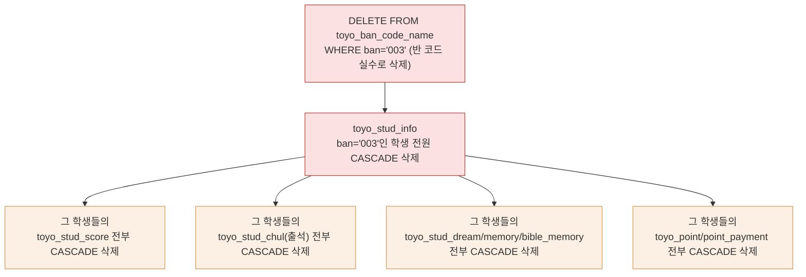

## 3-2. DDL — 재검증 결과

> 첨부된 `3-2. DDL(기존).md`를 `toyo테이블스키마DB_덤프.sql`(원본 컬럼 정의) 및 `phpcssjs소스.zip`(실제 WHERE/UPDATE 쿼리)과 전수 대조했다. **테이블 34개 전체의 컬럼명·타입·길이·NOT NULL은 프로그램으로 diff한 결과 전부 정확했다.** 문제는 컬럼 단위가 아니라 ①일부 테이블의 **PK 구성**, ②전체 FK에 일괄 적용된 **CASCADE 정책**, ③업무 테이블이 아닌 **`md5enc` 테이블 포함** 3가지였다. 아래에 근거와 함께 정리하고, 하단에 수정본 전체를 첨부한다.

---

### 검증 결과 1 — 제거 대상: `md5enc` 테이블

기존 문서는 "제외: 백업/임시/pack/날짜suffix 테이블, MySQL 시스템 테이블"이라고 명시했지만 `md5enc`가 그대로 포함되어 있었다. 이 테이블은 `SEQ, USERID, PASSWD(32자리)`만 있는 독립 테이블로, `TOYO_ID_INFO`(실제 로그인 계정)와 어떤 FK로도 연결되지 않고 `phpcssjs소스.zip` 256개 파일 어디에서도 참조되지 않는다. MD5 해시 연습용으로 만들어졌다가 방치된 것으로 보이는 **업무 무관 테이블**이므로 스키마에서 제외했다.

---

### 검증 결과 2 — PK 구성 오류 2건 (코드로 직접 확인)

| 테이블 | 기존 문서 PK | 실제 코드 근거 | 수정 |
|---|---|---|---|
| `toyo_reg_date_poss` | `(seq, poss_date)` | `banRegDatePossModifyProc.php` 80행: `WHERE SEQ = '$SEQ'` — **SEQ 단독**으로 행을 특정 | `(seq)` |
| `toyo_stud_score_hist` | `(seq, gubun, enroll_date, ban, stud_no, subject)` | `seq`를 `GENERATED BY DEFAULT AS IDENTITY`(자동 증가 서로게이트 키)로 선언해 놓고 정작 PK는 6개 컬럼 전부를 묶었다 — 서로게이트 키를 쓰는 의미가 없어짐. 원본 트리거(`TOYO_STUD_SCORE_TRI_INSERT`)도 `SEQ`에만 값을 맡기고 나머지로 유일성을 판단하지 않았다 | `(seq)` |

---

### 검증 결과 3 — PK에서 `ban` 제거 권고 (6개 테이블)

`toyo_stud_chul`, `toyo_stud_field_attend`, `toyo_stud_score`, `toyo_stud_bible_memory`, `toyo_stud_memory`, `toyo_stud_dream` 6개 테이블은 PK가 `(enroll_date, ban, stud_no, ...)`로 되어 있다. 그런데 **같은 패턴의 `toyo_point` 테이블만 유일하게 PK가 `(enroll_date, kind, stud_no)`로 `ban`이 빠져 있다** — `banStudPointEventModifyProc.php` 246행에서 `WHERE ENROLL_DATE=? AND KIND=? AND STUD_NO=?`로 직접 확인된다.

학생은 특정 날짜에 반이 하나뿐이므로 `ban`은 `(enroll_date, stud_no)`에 함수적으로 종속된 값이다 — PK에 넣어도 오류는 아니지만, **더 넓은 키일수록 "같은 날 같은 학생이 다른 반으로 중복 입력되는" 실수를 걸러내지 못한다**(좁은 키가 더 엄격한 제약이다). 코드로 실측된 `toyo_point`의 패턴을 기준으로 나머지 6개도 `ban`을 PK에서 빼고 일반 컬럼(+FK)으로 내렸다.

> ⚠️ 예외: `toyo_stud_dream_course`/`toyo_stud_dream_year_course`의 PK에 `dream_kind`가 들어간 것은 그대로 두었다. 두 테이블은 `phpcssjs소스.zip` 256개 파일 어디서도 참조되지 않는(0건) 미사용 테이블이라 실사용 쿼리로 검증할 방법이 없다 — 임의로 고치지 않고 원안을 유지했다.

---

### 검증 결과 4 (가장 중요) — FK `ON DELETE CASCADE` 전체 통일은 위험하다

기존 문서는 36개 FK 전부를 예외 없이 `CASCADE`로 통일했다. 이건 **이미 이 프로젝트의 3-3 SQLAlchemy 모델 예시에서 스스로 세운 원칙과 어긋난다** — 그 예시는 `user_id`(소유자 참조)는 `CASCADE`, `category_id`(마스터/코드 참조)는 `RESTRICT`로 명확히 구분했다. 이번 DDL은 그 구분을 지키지 않고 전부 CASCADE로 밀었다.

**실제로 얼마나 위험한지 연쇄를 따라가 보면:**



반 코드(`toyo_ban_code_name`) 하나를 잘못 지우면 **그 반 학생 전원의 출석·성적·포인트·진로 기록이 통째로 사라진다.** 실제로 기존 PHP 코드에서 "코드성 마스터"는 하드 `DELETE`가 아니라 `USE_YN='N'`(사용안함) 소프트 삭제로 운영되고 있었다(`banCodeNameModify.php`, `banBibleContestCodeModify.php` 등에서 확인) — 즉 원래 운영 방식 자체가 "코드 마스터는 지우지 않는다"였는데, 신규 DDL이 오히려 "지우면 다 같이 지워진다(CASCADE)"로 더 위험하게 만든 셈이다.

**수정 원칙** (§6 영속화 설계의 FK 위반 처리 원칙과도 일치):

| 참조 대상 | 정책 | 이유 |
|---|---|---|
| `toyo_stud_info.stud_no` (학생 소유 트랜잭션 데이터: 출석/성적/드림/암송/포인트 등) | **CASCADE** | 학생 삭제 시 그 학생의 종속 기록도 함께 정리되는 것이 정상 |
| `toyo_ban_code_name.ban`, `toyo_dream_kind.dream_kind`, `toyo_stud_code_name.subject`, `toyo_kind_name.kind`, `toyo_teacher_chul_code_name(teacher_kind,ban)` (코드성 마스터) | **RESTRICT** | 실수로 코드 하나 지웠다가 대량 연쇄 삭제되는 사고 방지. 삭제하려면 먼저 소속 데이터를 정리하라고 막아야 함 |
| `toyo_id_info.id` ← `toyo_id_info_hist` (로그인 이력) | **RESTRICT** | 시스템 접근 감사 목적 이력은 계정이 남아있는 한 임의로 사라지면 안 됨 |
| `toyo_team_game_score` ← `toyo_team_game_score_rows` (헤더-상세) | **CASCADE** | 상세 행은 헤더에 종속된 데이터, 헤더 삭제 시 함께 정리되는 것이 정상 |

---

### 검증 결과 5 — "미확정 FK 후보"에 대한 재검증

기존 문서가 "확인 필요"로 남겨둔 4개 항목을 실제로 확인했다.

| 항목 | 기존 문서 | 재검증 결과 |
|---|---|---|
| `toyo_team_score_plus.ban VARCHAR(20)` vs `ban_code_name.ban VARCHAR(3)` 길이 불일치 | 확인 필요 | **원본 덤프에서도 실제로 VARCHAR(20)로 선언되어 있음**(레거시 데이터 품질 문제, DDL 작성 실수 아님). 값 자체는 `001`~`009`처럼 3자리 컨벤션을 따르므로 신규 스키마에서는 `VARCHAR(3)`로 좁히고 FK(RESTRICT)를 정상 연결했다 |
| `team_game_score`/`_rows`/`team_score_plus`의 `kind VARCHAR(20)` vs `kind_name.kind VARCHAR(2)` | 확인 필요 | **연결하지 않는 것이 맞다.** `toyo_kind_name`은 포인트 종류 코드(2자리)이고, 팀게임의 `KIND`는 "게임 종류"를 나타내는 자유 문자열로 자릿수부터 다르다 — 컬럼명이 같을 뿐 서로 다른 도메인이다. FK를 억지로 연결하면 오히려 잘못된 제약이 된다 |
| `dream_kind_1/2/3` → `toyo_dream_kind` | 확인 필요 | 컬럼명·값 형식(VARCHAR(3))이 `dream_kind`와 동일해 같은 도메인임이 명확하다. `toyo_stud_new_info`, `toyo_stud_2hakgi_new_info`, `toyo_stud_dream` 3개 테이블에 각 3개씩 FK(RESTRICT) 9개를 추가했다 |
| `toyo_stud_score_hist → toyo_stud_score` 복합 FK | 확인 필요 | **추가하지 않는 것이 맞다.** 이력 테이블은 원본(라이브) 레코드와 생명주기가 달라야 한다 — 원본 성적이 수정/삭제되어도 이력은 그대로 남아있어야 감사 로그로서 의미가 있다. 원본 문서의 "미적용"은 사실 올바른 판단이었다 |

---

### 수정 반영 완료된 DDL 전체

```sql
-- ============================================
-- 토요하자 DB DDL (PostgreSQL 16) — 재검증/수정본
-- 기준: 운영 서버 SQL 덤프(toyo테이블스키마.sql) + phpcssjs소스.zip 실사 코드 교차검증
-- 제외: 백업/임시/pack/날짜suffix 테이블, MySQL 시스템 테이블, md5enc(비업무 테스트 테이블)
-- 정책: REG_DATE/MOD_DATE는 TIMESTAMP로 통일. FK는 참조 대상에 따라
--       CASCADE(학생 소유 트랜잭션 데이터) / RESTRICT(코드성 마스터, 감사이력) 분리 적용(§ 하단 표 참고)
-- ============================================

CREATE TABLE toyo_ban_code_name (
    ban VARCHAR(3),
    ban_name VARCHAR(100),
    ban_hp VARCHAR(100),
    ban_hp_enc BYTEA,
    use_yn VARCHAR(1),
    reg_date TIMESTAMP,
    reg_id VARCHAR(30),
    mod_date TIMESTAMP,
    mod_id VARCHAR(30),
    CONSTRAINT pk_toyo_ban_code_name PRIMARY KEY (ban)
);
CREATE TABLE toyo_ban_menu_name (
    menu VARCHAR(2),
    menu_name VARCHAR(100),
    src_name VARCHAR(100),
    order_by VARCHAR(2),
    mobile_order_by VARCHAR(2),
    level VARCHAR(1),
    group_no VARCHAR(2),
    use_yn VARCHAR(1),
    mobile_use_yn VARCHAR(1),
    menu_code VARCHAR(2),
    reg_date TIMESTAMP,
    reg_id VARCHAR(30),
    mod_date TIMESTAMP,
    mod_id VARCHAR(30),
    go_but_yn VARCHAR(1),
    go_but_nm VARCHAR(20),
    go_but_order_by VARCHAR(2),
    mobile_menu_name VARCHAR(100),
    mobile_but_yn VARCHAR(1),
    mobile_but_nm VARCHAR(20),
    mobile_but_order_by VARCHAR(2),
    CONSTRAINT pk_toyo_ban_menu_name PRIMARY KEY (menu)
);
CREATE TABLE toyo_bible_contest (
    contest_code VARCHAR(3),
    contest_rank VARCHAR(3),
    contest_point VARCHAR(3),
    use_yn VARCHAR(1),
    reg_date TIMESTAMP,
    reg_id VARCHAR(30),
    mod_date TIMESTAMP,
    mod_id VARCHAR(30),
    CONSTRAINT pk_toyo_bible_contest PRIMARY KEY (contest_code)
);
CREATE TABLE toyo_code_name (
    opt VARCHAR(20),
    code VARCHAR(6),
    code_name VARCHAR(100),
    kind_name VARCHAR(200),
    contents VARCHAR(4000),
    use_yn VARCHAR(1),
    reg_date TIMESTAMP,
    reg_id VARCHAR(30),
    mod_date TIMESTAMP,
    mod_id VARCHAR(30),
    CONSTRAINT pk_toyo_code_name PRIMARY KEY (opt, code)
);
CREATE TABLE toyo_dream_kind (
    dream_kind VARCHAR(3),
    dream_kind_name VARCHAR(100),
    grade VARCHAR(10),
    year_course VARCHAR(1),
    year VARCHAR(4),
    quarter VARCHAR(1),
    use_yn VARCHAR(1),
    reg_date TIMESTAMP,
    reg_id VARCHAR(30),
    mod_date TIMESTAMP,
    mod_id VARCHAR(30),
    CONSTRAINT pk_toyo_dream_kind PRIMARY KEY (dream_kind)
);
CREATE TABLE toyo_kind_name (
    kind VARCHAR(2),
    kind_name VARCHAR(100),
    use_yn VARCHAR(1),
    reg_date TIMESTAMP,
    reg_id VARCHAR(30),
    mod_date TIMESTAMP,
    mod_id VARCHAR(30),
    CONSTRAINT pk_toyo_kind_name PRIMARY KEY (kind)
);
CREATE TABLE toyo_stud_code_name (
    subject VARCHAR(3),
    subject_name VARCHAR(100),
    reg_date TIMESTAMP,
    reg_id VARCHAR(30),
    mod_date TIMESTAMP,
    mod_id VARCHAR(30),
    CONSTRAINT pk_toyo_stud_code_name PRIMARY KEY (subject)
);
CREATE TABLE toyo_stud_dream_support_grade (
    dream_kind VARCHAR(3),
    support_grade VARCHAR(6),
    use_yn VARCHAR(1),
    reg_date TIMESTAMP,
    reg_id VARCHAR(30),
    mod_date TIMESTAMP,
    mod_id VARCHAR(30),
    CONSTRAINT pk_toyo_stud_dream_support_grade PRIMARY KEY (dream_kind)
);
CREATE TABLE toyo_stud_field_attend_teacher (
    teacher_no VARCHAR(5),
    teacher_name VARCHAR(100),
    sex VARCHAR(1),
    hp VARCHAR(11),
    field_attend_kind VARCHAR(2),
    field_attend_nausea VARCHAR(2),
    field_attend_bus VARCHAR(2),
    teacher_kind VARCHAR(2),
    field_attend_insurance VARCHAR(2),
    use_yn VARCHAR(1),
    reg_date TIMESTAMP,
    reg_id VARCHAR(30),
    mod_date TIMESTAMP,
    mod_id VARCHAR(30),
    reason VARCHAR(200),
    CONSTRAINT pk_toyo_stud_field_attend_teacher PRIMARY KEY (teacher_no)
);
CREATE TABLE toyo_teacher_chul_code_name (
    teacher_kind VARCHAR(2),
    ban VARCHAR(3),
    ban_name VARCHAR(100),
    use_yn VARCHAR(1),
    reg_date TIMESTAMP,
    reg_id VARCHAR(30),
    mod_date TIMESTAMP,
    mod_id VARCHAR(30),
    CONSTRAINT pk_toyo_teacher_chul_code_name PRIMARY KEY (teacher_kind, ban)
);
CREATE TABLE toyo_id_info (
    id VARCHAR(20),
    passwd VARCHAR(64) NOT NULL,
    k_name VARCHAR(64) NOT NULL,
    use_yn VARCHAR(1),
    ssn VARCHAR(4),
    token VARCHAR(200),
    auth VARCHAR(2),
    login_first_time TIMESTAMP,
    login_last_time TIMESTAMP,
    reg_date TIMESTAMP,
    reg_id VARCHAR(30),
    mod_date TIMESTAMP,
    mod_id VARCHAR(30),
    id_img_path VARCHAR(200),
    id_img_name VARCHAR(200),
    group_code VARCHAR(2),
    teacher_hp_no_enc BYTEA,
    CONSTRAINT pk_toyo_id_info PRIMARY KEY (id)
);
CREATE TABLE toyo_id_info_hist (
    id VARCHAR(20),
    enroll_date VARCHAR(8),
    mac_address VARCHAR(100),
    reg_date TIMESTAMP,
    reg_id VARCHAR(30),
    mod_date TIMESTAMP,
    mod_id VARCHAR(30),
    CONSTRAINT pk_toyo_id_info_hist PRIMARY KEY (id, enroll_date)
);
CREATE TABLE toyo_stud_info (
    stud_no VARCHAR(5),
    ban VARCHAR(3),
    stud_name VARCHAR(100),
    grade VARCHAR(1),
    team VARCHAR(20),
    sex VARCHAR(1),
    one_year_yn VARCHAR(1),
    dream_kind VARCHAR(3),
    parents_no_hp_enc BYTEA,
    use_yn VARCHAR(1),
    reg_date TIMESTAMP,
    reg_id VARCHAR(30),
    mod_date TIMESTAMP,
    mod_id VARCHAR(30),
    attend_yn VARCHAR(1),
    stud_img_path VARCHAR(200),
    stud_img_name VARCHAR(200),
    parents_name VARCHAR(20),
    CONSTRAINT pk_toyo_stud_info PRIMARY KEY (stud_no)
);
CREATE TABLE toyo_stud_2hakgi_info (
    stud_no VARCHAR(5),
    ban VARCHAR(3),
    stud_name VARCHAR(100),
    grade VARCHAR(1),
    team VARCHAR(20),
    rereg_kind VARCHAR(2),
    reason VARCHAR(200),
    enroll_date VARCHAR(8),
    reg_date TIMESTAMP,
    reg_id VARCHAR(30),
    mod_date TIMESTAMP,
    mod_id VARCHAR(30),
    CONSTRAINT pk_toyo_stud_2hakgi_info PRIMARY KEY (stud_no)
);
CREATE TABLE toyo_stud_2hakgi_new_info (
    stud_no VARCHAR(5),
    stud_name VARCHAR(100),
    sex VARCHAR(1),
    grade VARCHAR(1),
    parent_name VARCHAR(20),
    parent_hp VARCHAR(11),
    request_teacher_name VARCHAR(20),
    request_method VARCHAR(100),
    church_reg_status VARCHAR(3),
    etc VARCHAR(400),
    reg_fee_kind VARCHAR(2),
    progress_status VARCHAR(3),
    enroll_date VARCHAR(8),
    reg_date TIMESTAMP,
    reg_id VARCHAR(30),
    mod_date TIMESTAMP,
    mod_id VARCHAR(30),
    dream_kind_1 VARCHAR(3),
    dream_kind_2 VARCHAR(3),
    dream_kind_3 VARCHAR(3),
    CONSTRAINT pk_toyo_stud_2hakgi_new_info PRIMARY KEY (stud_no)
);
CREATE TABLE toyo_stud_new_info (
    stud_no VARCHAR(5),
    stud_name VARCHAR(100),
    sex VARCHAR(1),
    grade VARCHAR(1),
    parent_name VARCHAR(20),
    parent_hp VARCHAR(11),
    request_teacher_name VARCHAR(20),
    request_method VARCHAR(100),
    church_reg_status VARCHAR(3),
    etc VARCHAR(400),
    reg_fee_kind VARCHAR(2),
    progress_status VARCHAR(3),
    enroll_date VARCHAR(8),
    reg_date TIMESTAMP,
    reg_id VARCHAR(30),
    mod_date TIMESTAMP,
    mod_id VARCHAR(30),
    dream_kind_1 VARCHAR(3),
    dream_kind_2 VARCHAR(3),
    dream_kind_3 VARCHAR(3),
    CONSTRAINT pk_toyo_stud_new_info PRIMARY KEY (stud_no)
);
CREATE TABLE toyo_stud_reg_fee (
    stud_no VARCHAR(5),
    reg_fee_kind VARCHAR(2),
    reason VARCHAR(200),
    new_yn VARCHAR(1),
    year VARCHAR(4),
    quarter VARCHAR(1),
    enroll_date VARCHAR(8),
    reg_date TIMESTAMP,
    reg_id VARCHAR(30),
    mod_date TIMESTAMP,
    mod_id VARCHAR(30),
    CONSTRAINT pk_toyo_stud_reg_fee PRIMARY KEY (stud_no)
);
CREATE TABLE toyo_stud_field_attend (
    enroll_date VARCHAR(8),
    ban VARCHAR(3),
    stud_no VARCHAR(5),
    field_attend_kind VARCHAR(2),
    reason VARCHAR(200),
    field_attend_nausea VARCHAR(2),
    field_attend_bus VARCHAR(2),
    field_attend_insurance VARCHAR(2) NOT NULL,
    confirm_yn VARCHAR(1),
    reg_date TIMESTAMP,
    reg_id VARCHAR(30),
    mod_date TIMESTAMP,
    mod_id VARCHAR(30),
    CONSTRAINT pk_toyo_stud_field_attend PRIMARY KEY (enroll_date, stud_no)
);
CREATE TABLE toyo_stud_bible_memory (
    enroll_date VARCHAR(8),
    ban VARCHAR(3),
    stud_no VARCHAR(5),
    degree_no VARCHAR(2),
    pass_no VARCHAR(2),
    reg_date TIMESTAMP,
    reg_id VARCHAR(30),
    mod_date TIMESTAMP,
    mod_id VARCHAR(30),
    present VARCHAR(3),
    bible_chul VARCHAR(2),
    CONSTRAINT pk_toyo_stud_bible_memory PRIMARY KEY (enroll_date, stud_no)
);
CREATE TABLE toyo_stud_chul (
    enroll_date VARCHAR(8),
    ban VARCHAR(3),
    stud_no VARCHAR(5),
    chul_kind VARCHAR(2),
    reason VARCHAR(200),
    reg_date TIMESTAMP,
    reg_id VARCHAR(30),
    mod_date TIMESTAMP,
    mod_id VARCHAR(30),
    CONSTRAINT pk_toyo_stud_chul PRIMARY KEY (enroll_date, stud_no)
);
CREATE TABLE toyo_stud_dream (
    enroll_date VARCHAR(8),
    ban VARCHAR(3),
    stud_no VARCHAR(5),
    dream_kind_1 VARCHAR(3),
    dream_kind_2 VARCHAR(3),
    dream_kind_3 VARCHAR(3),
    use_yn VARCHAR(1),
    reg_date TIMESTAMP,
    reg_id VARCHAR(30),
    mod_date TIMESTAMP,
    mod_id VARCHAR(30),
    CONSTRAINT pk_toyo_stud_dream PRIMARY KEY (enroll_date, stud_no)
);
CREATE TABLE toyo_stud_dream_course (
    stud_no VARCHAR(5),
    year VARCHAR(4),
    quarter VARCHAR(1),
    dream_kind VARCHAR(3),
    use_yn VARCHAR(1),
    reg_date TIMESTAMP,
    reg_id VARCHAR(30),
    mod_date TIMESTAMP,
    mod_id VARCHAR(30),
    CONSTRAINT pk_toyo_stud_dream_course PRIMARY KEY (stud_no, year, quarter, dream_kind)
);
CREATE TABLE toyo_stud_dream_year_course (
    stud_no VARCHAR(5),
    year VARCHAR(4),
    quarter VARCHAR(1),
    dream_kind VARCHAR(3),
    use_yn VARCHAR(1),
    reg_date TIMESTAMP,
    reg_id VARCHAR(30),
    mod_date TIMESTAMP,
    mod_id VARCHAR(30),
    CONSTRAINT pk_toyo_stud_dream_year_course PRIMARY KEY (stud_no, year, quarter, dream_kind)
);
CREATE TABLE toyo_stud_memory (
    enroll_date VARCHAR(8),
    ban VARCHAR(3),
    stud_no VARCHAR(5),
    memory_kind_1 VARCHAR(3),
    memory_kind_2 VARCHAR(3),
    memory_kind_3 VARCHAR(3),
    reg_date TIMESTAMP,
    reg_id VARCHAR(30),
    mod_date TIMESTAMP,
    mod_id VARCHAR(30),
    CONSTRAINT pk_toyo_stud_memory PRIMARY KEY (enroll_date, stud_no)
);
CREATE TABLE toyo_stud_score (
    enroll_date VARCHAR(8),
    ban VARCHAR(3),
    stud_no VARCHAR(5),
    subject VARCHAR(3),
    score INTEGER,
    reg_date TIMESTAMP,
    reg_id VARCHAR(30),
    mod_date TIMESTAMP,
    mod_id VARCHAR(30),
    CONSTRAINT pk_toyo_stud_score PRIMARY KEY (enroll_date, stud_no, subject)
);
CREATE TABLE toyo_stud_score_hist (
    seq INTEGER GENERATED BY DEFAULT AS IDENTITY,
    gubun VARCHAR(1),
    enroll_date VARCHAR(8),
    ban VARCHAR(3),
    stud_no VARCHAR(5),
    subject VARCHAR(3),
    score INTEGER,
    reg_date TIMESTAMP,
    reg_id VARCHAR(30),
    mod_date TIMESTAMP,
    mod_id VARCHAR(30),
    CONSTRAINT pk_toyo_stud_score_hist PRIMARY KEY (seq)
);
CREATE TABLE toyo_teacher_chul (
    enroll_date VARCHAR(8),
    teacher_kind VARCHAR(2),
    ban VARCHAR(3),
    chul_yn VARCHAR(1),
    reason VARCHAR(200),
    reg_date TIMESTAMP,
    reg_id VARCHAR(30),
    mod_date TIMESTAMP,
    mod_id VARCHAR(30),
    CONSTRAINT pk_toyo_teacher_chul PRIMARY KEY (enroll_date, teacher_kind, ban)
);
CREATE TABLE toyo_team_game_score (
    enroll_date VARCHAR(8),
    kind VARCHAR(20),
    team VARCHAR(20),
    score INTEGER,
    display_yn VARCHAR(100),
    reg_date TIMESTAMP,
    reg_id VARCHAR(30),
    mod_date TIMESTAMP,
    mod_id VARCHAR(30),
    CONSTRAINT pk_toyo_team_game_score PRIMARY KEY (enroll_date, kind, team)
);
CREATE TABLE toyo_team_game_score_rows (
    enroll_date VARCHAR(8),
    kind VARCHAR(20),
    team VARCHAR(20),
    seq INTEGER,
    score INTEGER,
    reg_date TIMESTAMP,
    reg_id VARCHAR(30),
    mod_date TIMESTAMP,
    mod_id VARCHAR(30),
    CONSTRAINT pk_toyo_team_game_score_rows PRIMARY KEY (enroll_date, kind, team, seq)
);
CREATE TABLE toyo_team_score_plus (
    enroll_date VARCHAR(8),
    kind VARCHAR(20),
    ban VARCHAR(3),
    team VARCHAR(20),
    score INTEGER,
    reg_date TIMESTAMP,
    reg_id VARCHAR(30),
    mod_date TIMESTAMP,
    mod_id VARCHAR(30),
    CONSTRAINT pk_toyo_team_score_plus PRIMARY KEY (enroll_date, kind, ban, team)
);
CREATE TABLE toyo_point (
    enroll_date VARCHAR(8),
    kind VARCHAR(2),
    stud_no VARCHAR(5),
    point VARCHAR(3),
    etc VARCHAR(400),
    ban VARCHAR(3),
    team VARCHAR(20),
    top_team_kor VARCHAR(400),
    chul_kind VARCHAR(2),
    point_reg_kind VARCHAR(2),
    point_event_kind VARCHAR(2),
    reg_date TIMESTAMP,
    reg_id VARCHAR(30),
    mod_date TIMESTAMP,
    mod_id VARCHAR(30),
    CONSTRAINT pk_toyo_point PRIMARY KEY (enroll_date, kind, stud_no)
);
CREATE TABLE toyo_point_payment (
    enroll_date VARCHAR(8),
    stud_no VARCHAR(5),
    point VARCHAR(3),
    etc VARCHAR(400),
    reg_date TIMESTAMP,
    reg_id VARCHAR(30),
    mod_date TIMESTAMP,
    mod_id VARCHAR(30),
    CONSTRAINT pk_toyo_point_payment PRIMARY KEY (enroll_date, stud_no)
);
CREATE TABLE toyo_reg_date_poss (
    seq VARCHAR(3),
    poss_date VARCHAR(8),
    use_yn VARCHAR(1),
    reg_date TIMESTAMP,
    reg_id VARCHAR(30),
    mod_date TIMESTAMP,
    mod_id VARCHAR(30),
    CONSTRAINT pk_toyo_reg_date_poss PRIMARY KEY (seq)
);
CREATE TABLE toyo_notice_info (
    notice_no VARCHAR(5),
    title VARCHAR(200) NOT NULL,
    contents VARCHAR(4000) NOT NULL,
    notice_start_date VARCHAR(8),
    notice_end_date VARCHAR(8),
    use_yn VARCHAR(1),
    reg_date TIMESTAMP,
    reg_id VARCHAR(30),
    mod_date TIMESTAMP,
    mod_id VARCHAR(30),
    CONSTRAINT pk_toyo_notice_info PRIMARY KEY (notice_no)
);

-- ============================================
-- Foreign Key 제약
-- 원칙: stud_no(학생 소유 트랜잭션 데이터) 참조 = ON DELETE CASCADE
--       코드성 마스터(ban/dream_kind/subject/kind/teacher_kind+ban) 참조 = ON DELETE RESTRICT
--       계정 접근감사 이력(id_info_hist) = ON DELETE RESTRICT (계정 삭제와 무관하게 이력 보존)
-- ============================================

-- [CASCADE] 학생(stud_no) 소유 트랜잭션 데이터 — 학생 삭제 시 함께 삭제
ALTER TABLE toyo_stud_2hakgi_info ADD CONSTRAINT fk_toyo_stud_2hakgi_info_stud_no FOREIGN KEY (stud_no) REFERENCES toyo_stud_info (stud_no) ON DELETE CASCADE;
ALTER TABLE toyo_stud_2hakgi_new_info ADD CONSTRAINT fk_toyo_stud_2hakgi_new_info_stud_no FOREIGN KEY (stud_no) REFERENCES toyo_stud_info (stud_no) ON DELETE CASCADE;
ALTER TABLE toyo_stud_new_info ADD CONSTRAINT fk_toyo_stud_new_info_stud_no FOREIGN KEY (stud_no) REFERENCES toyo_stud_info (stud_no) ON DELETE CASCADE;
ALTER TABLE toyo_stud_reg_fee ADD CONSTRAINT fk_toyo_stud_reg_fee_stud_no FOREIGN KEY (stud_no) REFERENCES toyo_stud_info (stud_no) ON DELETE CASCADE;
ALTER TABLE toyo_stud_field_attend ADD CONSTRAINT fk_toyo_stud_field_attend_stud_no FOREIGN KEY (stud_no) REFERENCES toyo_stud_info (stud_no) ON DELETE CASCADE;
ALTER TABLE toyo_stud_bible_memory ADD CONSTRAINT fk_toyo_stud_bible_memory_stud_no FOREIGN KEY (stud_no) REFERENCES toyo_stud_info (stud_no) ON DELETE CASCADE;
ALTER TABLE toyo_stud_chul ADD CONSTRAINT fk_toyo_stud_chul_stud_no FOREIGN KEY (stud_no) REFERENCES toyo_stud_info (stud_no) ON DELETE CASCADE;
ALTER TABLE toyo_stud_dream ADD CONSTRAINT fk_toyo_stud_dream_stud_no FOREIGN KEY (stud_no) REFERENCES toyo_stud_info (stud_no) ON DELETE CASCADE;
ALTER TABLE toyo_stud_dream_course ADD CONSTRAINT fk_toyo_stud_dream_course_stud_no FOREIGN KEY (stud_no) REFERENCES toyo_stud_info (stud_no) ON DELETE CASCADE;
ALTER TABLE toyo_stud_dream_year_course ADD CONSTRAINT fk_toyo_stud_dream_year_course_stud_no FOREIGN KEY (stud_no) REFERENCES toyo_stud_info (stud_no) ON DELETE CASCADE;
ALTER TABLE toyo_stud_memory ADD CONSTRAINT fk_toyo_stud_memory_stud_no FOREIGN KEY (stud_no) REFERENCES toyo_stud_info (stud_no) ON DELETE CASCADE;
ALTER TABLE toyo_stud_score ADD CONSTRAINT fk_toyo_stud_score_stud_no FOREIGN KEY (stud_no) REFERENCES toyo_stud_info (stud_no) ON DELETE CASCADE;
ALTER TABLE toyo_stud_score_hist ADD CONSTRAINT fk_toyo_stud_score_hist_stud_no FOREIGN KEY (stud_no) REFERENCES toyo_stud_info (stud_no) ON DELETE CASCADE;
ALTER TABLE toyo_point ADD CONSTRAINT fk_toyo_point_stud_no FOREIGN KEY (stud_no) REFERENCES toyo_stud_info (stud_no) ON DELETE CASCADE;
ALTER TABLE toyo_point_payment ADD CONSTRAINT fk_toyo_point_payment_stud_no FOREIGN KEY (stud_no) REFERENCES toyo_stud_info (stud_no) ON DELETE CASCADE;

-- [CASCADE] 상세 행 — 헤더(팀게임 점수) 소유, 헤더 삭제 시 상세도 함께 삭제
ALTER TABLE toyo_team_game_score_rows ADD CONSTRAINT fk_toyo_team_game_score_rows_header FOREIGN KEY (enroll_date, kind, team) REFERENCES toyo_team_game_score (enroll_date, kind, team) ON DELETE CASCADE;

-- [RESTRICT] 코드성 마스터(ban) 참조 — 소속 데이터가 있으면 코드 삭제 자체를 차단
ALTER TABLE toyo_stud_info ADD CONSTRAINT fk_toyo_stud_info_ban FOREIGN KEY (ban) REFERENCES toyo_ban_code_name (ban) ON DELETE RESTRICT;
ALTER TABLE toyo_stud_2hakgi_info ADD CONSTRAINT fk_toyo_stud_2hakgi_info_ban FOREIGN KEY (ban) REFERENCES toyo_ban_code_name (ban) ON DELETE RESTRICT;
ALTER TABLE toyo_stud_field_attend ADD CONSTRAINT fk_toyo_stud_field_attend_ban FOREIGN KEY (ban) REFERENCES toyo_ban_code_name (ban) ON DELETE RESTRICT;
ALTER TABLE toyo_stud_bible_memory ADD CONSTRAINT fk_toyo_stud_bible_memory_ban FOREIGN KEY (ban) REFERENCES toyo_ban_code_name (ban) ON DELETE RESTRICT;
ALTER TABLE toyo_stud_chul ADD CONSTRAINT fk_toyo_stud_chul_ban FOREIGN KEY (ban) REFERENCES toyo_ban_code_name (ban) ON DELETE RESTRICT;
ALTER TABLE toyo_stud_dream ADD CONSTRAINT fk_toyo_stud_dream_ban FOREIGN KEY (ban) REFERENCES toyo_ban_code_name (ban) ON DELETE RESTRICT;
ALTER TABLE toyo_stud_memory ADD CONSTRAINT fk_toyo_stud_memory_ban FOREIGN KEY (ban) REFERENCES toyo_ban_code_name (ban) ON DELETE RESTRICT;
ALTER TABLE toyo_stud_score ADD CONSTRAINT fk_toyo_stud_score_ban FOREIGN KEY (ban) REFERENCES toyo_ban_code_name (ban) ON DELETE RESTRICT;
ALTER TABLE toyo_stud_score_hist ADD CONSTRAINT fk_toyo_stud_score_hist_ban FOREIGN KEY (ban) REFERENCES toyo_ban_code_name (ban) ON DELETE RESTRICT;
ALTER TABLE toyo_teacher_chul ADD CONSTRAINT fk_toyo_teacher_chul_ban FOREIGN KEY (ban) REFERENCES toyo_ban_code_name (ban) ON DELETE RESTRICT;
ALTER TABLE toyo_teacher_chul_code_name ADD CONSTRAINT fk_toyo_teacher_chul_code_name_ban FOREIGN KEY (ban) REFERENCES toyo_ban_code_name (ban) ON DELETE RESTRICT;
ALTER TABLE toyo_point ADD CONSTRAINT fk_toyo_point_ban FOREIGN KEY (ban) REFERENCES toyo_ban_code_name (ban) ON DELETE RESTRICT;
ALTER TABLE toyo_team_score_plus ADD CONSTRAINT fk_toyo_team_score_plus_ban FOREIGN KEY (ban) REFERENCES toyo_ban_code_name (ban) ON DELETE RESTRICT;

-- [RESTRICT] 코드성 마스터(dream_kind) 참조
ALTER TABLE toyo_stud_info ADD CONSTRAINT fk_toyo_stud_info_dream_kind FOREIGN KEY (dream_kind) REFERENCES toyo_dream_kind (dream_kind) ON DELETE RESTRICT;
ALTER TABLE toyo_stud_dream_course ADD CONSTRAINT fk_toyo_stud_dream_course_dream_kind FOREIGN KEY (dream_kind) REFERENCES toyo_dream_kind (dream_kind) ON DELETE RESTRICT;
ALTER TABLE toyo_stud_dream_year_course ADD CONSTRAINT fk_toyo_stud_dream_year_course_dream_kind FOREIGN KEY (dream_kind) REFERENCES toyo_dream_kind (dream_kind) ON DELETE RESTRICT;
ALTER TABLE toyo_stud_dream_support_grade ADD CONSTRAINT fk_toyo_stud_dream_support_grade_dream_kind FOREIGN KEY (dream_kind) REFERENCES toyo_dream_kind (dream_kind) ON DELETE RESTRICT;
ALTER TABLE toyo_stud_new_info ADD CONSTRAINT fk_toyo_stud_new_info_dream_kind_1 FOREIGN KEY (dream_kind_1) REFERENCES toyo_dream_kind (dream_kind) ON DELETE RESTRICT;
ALTER TABLE toyo_stud_new_info ADD CONSTRAINT fk_toyo_stud_new_info_dream_kind_2 FOREIGN KEY (dream_kind_2) REFERENCES toyo_dream_kind (dream_kind) ON DELETE RESTRICT;
ALTER TABLE toyo_stud_new_info ADD CONSTRAINT fk_toyo_stud_new_info_dream_kind_3 FOREIGN KEY (dream_kind_3) REFERENCES toyo_dream_kind (dream_kind) ON DELETE RESTRICT;
ALTER TABLE toyo_stud_2hakgi_new_info ADD CONSTRAINT fk_toyo_stud_2hakgi_new_info_dream_kind_1 FOREIGN KEY (dream_kind_1) REFERENCES toyo_dream_kind (dream_kind) ON DELETE RESTRICT;
ALTER TABLE toyo_stud_2hakgi_new_info ADD CONSTRAINT fk_toyo_stud_2hakgi_new_info_dream_kind_2 FOREIGN KEY (dream_kind_2) REFERENCES toyo_dream_kind (dream_kind) ON DELETE RESTRICT;
ALTER TABLE toyo_stud_2hakgi_new_info ADD CONSTRAINT fk_toyo_stud_2hakgi_new_info_dream_kind_3 FOREIGN KEY (dream_kind_3) REFERENCES toyo_dream_kind (dream_kind) ON DELETE RESTRICT;
ALTER TABLE toyo_stud_dream ADD CONSTRAINT fk_toyo_stud_dream_dream_kind_1 FOREIGN KEY (dream_kind_1) REFERENCES toyo_dream_kind (dream_kind) ON DELETE RESTRICT;
ALTER TABLE toyo_stud_dream ADD CONSTRAINT fk_toyo_stud_dream_dream_kind_2 FOREIGN KEY (dream_kind_2) REFERENCES toyo_dream_kind (dream_kind) ON DELETE RESTRICT;
ALTER TABLE toyo_stud_dream ADD CONSTRAINT fk_toyo_stud_dream_dream_kind_3 FOREIGN KEY (dream_kind_3) REFERENCES toyo_dream_kind (dream_kind) ON DELETE RESTRICT;

-- [RESTRICT] 코드성 마스터(subject/kind) 참조
ALTER TABLE toyo_stud_score ADD CONSTRAINT fk_toyo_stud_score_subject FOREIGN KEY (subject) REFERENCES toyo_stud_code_name (subject) ON DELETE RESTRICT;
ALTER TABLE toyo_stud_score_hist ADD CONSTRAINT fk_toyo_stud_score_hist_subject FOREIGN KEY (subject) REFERENCES toyo_stud_code_name (subject) ON DELETE RESTRICT;
ALTER TABLE toyo_point ADD CONSTRAINT fk_toyo_point_kind FOREIGN KEY (kind) REFERENCES toyo_kind_name (kind) ON DELETE RESTRICT;

-- [RESTRICT] 복합 코드 마스터(teacher_kind, ban) 참조
ALTER TABLE toyo_teacher_chul ADD CONSTRAINT fk_toyo_teacher_chul_teacher_kind_ban FOREIGN KEY (teacher_kind, ban) REFERENCES toyo_teacher_chul_code_name (teacher_kind, ban) ON DELETE RESTRICT;

-- [RESTRICT] 계정 접근감사 이력 — 계정이 존재하는 한 로그인 이력은 보존(계정 삭제 전 이력부터 정리해야 함)
ALTER TABLE toyo_id_info_hist ADD CONSTRAINT fk_toyo_id_info_hist_id FOREIGN KEY (id) REFERENCES toyo_id_info (id) ON DELETE RESTRICT;

```
