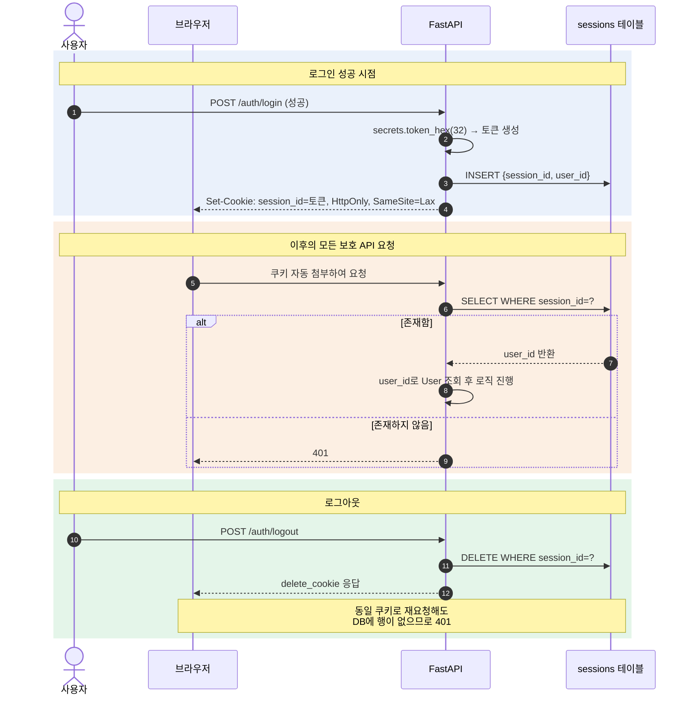

## 5. 인증 설계

### 5-1. 방식 선정 — 세션 쿠키 vs JWT

| 비교 항목 | 세션 쿠키(채택) | JWT(미채택, 향후 확장) |
|---|---|---|
| 추가 라이브러리 | 0개(secrets 표준) | PyJWT 등 별도 필요 |
| 화면 코드 복잡도 | 쿠키 자동 보관/첨부 | 저장+헤더 첨부 코드 필요 |
| 실무 사용처 | 전통 웹 프레임워크 기본 방식 | 모바일/MSA 간 통신 |
| 로그인 상태 확인 | sessions SELECT로 직접 확인 | 토큰 자체 서명 검증 |
| 로그아웃 | 행 삭제=즉시 무효화 | 만료 전 유효(블랙리스트 별도 필요) |
| 채택 여부 | 채택(기본 인증) | 심화 과정 이관 |

### 5-2. 비밀번호 해싱

```python
# security.py
from pwdlib import PasswordHash
password_hash = PasswordHash.recommended()  # Argon2

def hash_password(plain: str) -> str:
    return password_hash.hash(plain)

def verify_password(plain: str, hashed: str) -> bool:
    return password_hash.verify(plain, hashed)
```

원칙: 비밀번호는 어떤 경우에도 원문 저장하지 않는다. `password_hash` 컬럼은 `UserOut` 응답 스키마에 절대 포함하지 않는다.

### 5-3. 세션 발급/검증 흐름

> 💡 v1.0의 번호 목록(①~⑩)을 시퀀스 다이어그램으로 재구성했습니다. 로그인·이후 요청·로그아웃 3단계가 시간 순서로 어떻게 이어지는지 한 그림에서 확인할 수 있습니다.



### 5-4. get_current_user 상세

| 단계 | 확인 | 실패 시 |
|---|---|---|
| ① | 쿠키 존재 | 401 |
| ② | sessions 테이블 존재 여부 | 401(위조/로그아웃된 세션) |
| ③ | 세션 행의 user_id로 users 조회 | (정상 흐름에서 미발생, FK 보장) |
| ④ | User 객체 반환 | — |

```python
def get_current_user(
    session_id: str | None = Cookie(default=None),
    db: Session = Depends(get_db),
) -> models.User:
    if session_id is None:
        raise HTTPException(401, "로그인이 필요합니다")
    session = db.get(models.LoginSession, session_id)
    if session is None:
        raise HTTPException(401, "로그인이 필요합니다")
    return db.get(models.User, session.user_id)

# 보호 라우터 적용
def add_contact(data: ContactCreate,
                 user: models.User = Depends(get_current_user),
                 db: Session = Depends(get_db)):
    ...
```

### 5-5. 보안 고려사항

| 항목 | 규칙 | 근거 |
|---|---|---|
| 쿠키 HttpOnly | 설정 | JS의 쿠키 접근 차단, XSS 세션 탈취 방지 |
| **쿠키 SameSite (신규)** | `Lax` 이상 설정 | 타 사이트에서 발생한 요청에 쿠키가 자동 첨부되는 것을 막아 CSRF 위험 완화 |
| 로그인 실패 응답 | 동일 문구로 통일 | 계정 열거(enumeration) 공격 방지 |
| 타인 데이터 접근 | 403 아닌 404 | 데이터 존재 자체 비노출. 조회 조건에 user_id 포함 시 자연 구현 |
| 비밀번호 저장 | Argon2 해시만 | DB 유출 시에도 원문 비노출 |

> ⚠️ **SameSite 속성 누락 (v1.0에 없던 항목, 신규 추가)**: v1.0은 HttpOnly만 명시하고 SameSite를 언급하지 않았습니다. 로컬 개발(127.0.0.1, N4 비목표)에서는 당장 문제가 되지 않지만, "왜 필요한지 모른 채 빠뜨리는 것"과 "알고 나서 범위 밖으로 미루는 것"은 다릅니다. 아래 코드로 명확히 고정합니다.
>
> ```python
> response.set_cookie(
>     "session_id", token,
>     httponly=True,
>     samesite="lax",   # 신규: 기본 CSRF 완화
>     # secure=True,     # 신규: HTTPS 배포 시(§11 향후 확장) 활성화. 로컬 HTTP 환경에서는 미설정.
> )
> ```