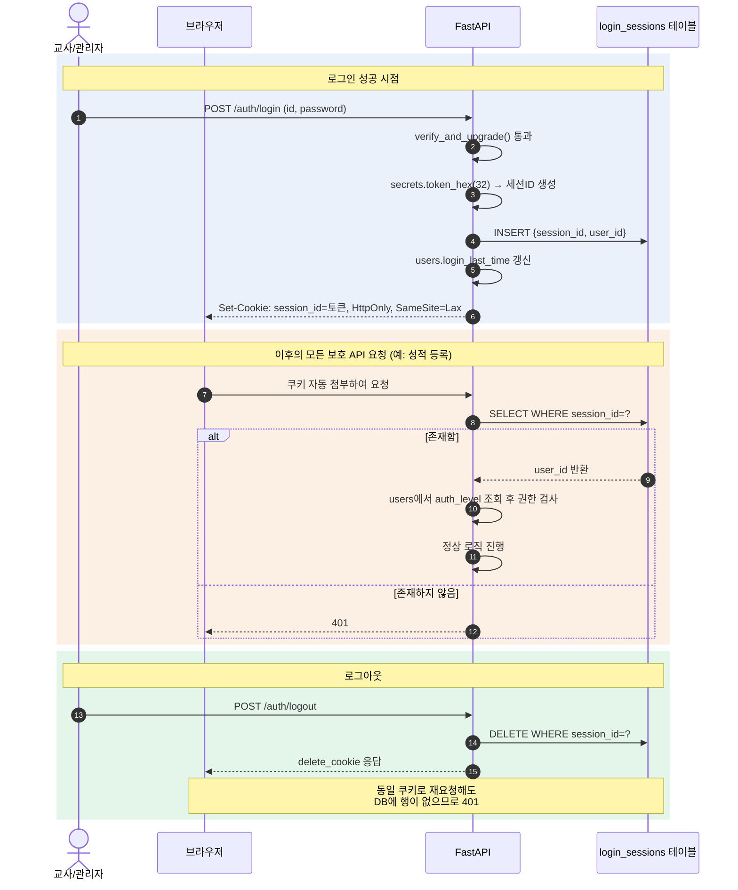

## 5. 인증 설계

> toyo 프로젝트(교사용 학생관리 시스템) 신규 인증 설계다. 기준 문서(`5.인증설계(기존설계).md`)의 구조와 기술 방향(세션 쿠키 + Argon2 + DB 세션 테이블)을 그대로 따르되, 아래 두 산출물을 근거로 toyo 도메인에 맞게 재작성했다.
> - `toyo테이블스키마DB_덤프.sql` — 기존 `TOYO_ID_INFO` 테이블 구조(교사/관리자 계정)
> - `phpcssjs소스.zip` — 기존 로그인 구현(`loginFormProc.php`, `logoutFormProc.php`, `menuSelect.php` 등) 실사 코드

### 5-1. 방식 선정 — 세션 쿠키 vs JWT

| 비교 항목 | 세션 쿠키(채택) | JWT(미채택, 향후 확장) |
|---|---|---|
| 추가 라이브러리 | 0개(secrets 표준) | PyJWT 등 별도 필요 |
| 화면 코드 복잡도 | 쿠키 자동 보관/첨부 | 저장+헤더 첨부 코드 필요 |
| 실무 사용처 | 전통 웹 프레임워크 기본 방식 | 모바일/MSA 간 통신 |
| 로그인 상태 확인 | sessions SELECT로 직접 확인 | 토큰 자체 서명 검증 |
| 로그아웃 | 행 삭제=즉시 무효화 | 만료 전 유효(블랙리스트 별도 필요) |
| 채택 여부 | 채택(기본 인증) | 심화 과정 이관 |

> ⚠️ **기존(PHP) 방식과의 결정적 차이**: 기존 시스템도 `session_start()` 기반 세션 쿠키였지만, "행 삭제=즉시 무효화"가 **표에만 있고 실제로 구현되지 않았다.** `logoutFormProc.php`는 세션 값을 빈 문자열로 초기화만 할 뿐 세션 자체를 파기하지 않았고, 토큰도 `TOYO_ID_INFO.TOKEN` 컬럼(사용자당 1개)에 저장해 "삭제"가 아닌 "덮어쓰기"로만 관리됐다. 신규 설계는 세션을 **별도 테이블의 행**으로 분리해 `DELETE` = 즉시 무효화를 코드 구조로 보장한다(5-3 참고).

toyo는 교사·관리자만 로그인하는 폐쇄형 백오피스이며 외부 API·모바일 연동 계획이 없다. 세션 쿠키만으로 충분하고, JWT의 무상태·크로스도메인 이점이 실익으로 이어지지 않는다.

---

### 5-2. 비밀번호 해싱

```python
# security.py
from pwdlib import PasswordHash

password_hash = PasswordHash.recommended()  # Argon2

def hash_password(plain: str) -> str:
    return password_hash.hash(plain)

def verify_password(plain: str, hashed: str) -> bool:
    return password_hash.verify(plain, hashed)
```

원칙: 비밀번호는 어떤 경우에도 원문 저장하지 않는다. `password_hash` 컬럼은 `UserOut` 응답 스키마에 절대 포함하지 않는다.

> ⚠️ **기존(PHP) 방식과의 차이**: 기존 `TOYO_ID_INFO.PASSWD`는 `MD5(비밀번호)`(무솔트)로 저장됐고, 검증도 `WHERE PASSWD = MD5('$PASSWD')` 형태로 DB에서 직접 비교했다(SQL 문자열 결합 — 인젝션 여지 포함). Argon2는 이 두 문제(약한 해시, DB단 평문 결합)를 모두 제거한다.

**레거시 계정 마이그레이션(지연 재해시)** — 기존 교사 계정을 일괄 초기화하면 운영 혼선이 크므로, 로그인 시점에 자동 전환한다.

```python
import hashlib

def verify_and_upgrade(plain: str, stored: str, user_id: str, db: Session) -> bool:
    if len(stored) == 32:  # 레거시 MD5 해시(32자리 hex)로 판단
        if hashlib.md5(plain.encode()).hexdigest() != stored:
            return False
        # 검증 성공 시 즉시 Argon2로 교체
        db.execute(
            update(models.User)
            .where(models.User.id == user_id)
            .values(password_hash=hash_password(plain))
        )
        db.commit()
        return True
    return verify_password(plain, stored)
```

사용자는 비밀번호를 다시 입력할 필요 없이, 다음 로그인 시점부터 자동으로 안전한 해시로 전환된다.

---

### 5-3. 세션 발급/검증 흐름



> 💡 기존 시스템은 로그인 이력을 `TOYO_ID_INFO_HIST`에 **날짜 단위 1건**으로만 남겼다(같은 날 재로그인은 upsert로 덮어써 이력이 소실됨). `login_sessions`는 로그인마다 독립된 행이므로, 필요 시 이 테이블을 그대로 로그인 이력 조회에도 활용할 수 있다(별도 이력 테이블 불필요).

---

### 5-4. get_current_user 상세

| 단계 | 확인 | 실패 시 |
|---|---|---|
| ① | 쿠키 존재 | 401 |
| ② | login_sessions 행 존재 여부 | 401(위조/로그아웃된 세션) |
| ③ | 세션 행의 user_id로 users 조회 | (정상 흐름에서 미발생, FK 보장) |
| ④ | User 객체 반환 | — |

```python
def get_current_user(
    session_id: str | None = Cookie(default=None),
    db: Session = Depends(get_db),
) -> models.User:
    if session_id is None:
        raise HTTPException(401, "로그인이 필요합니다")
    session = db.get(models.LoginSession, session_id)
    if session is None:
        raise HTTPException(401, "로그인이 필요합니다")
    return db.get(models.User, session.user_id)
```

toyo는 `AUTH`(권한 레벨 0~8) 기반 기능 접근 제어가 실제 업무 요구사항이므로, `get_current_user` 위에 권한 레벨 검사 의존성을 한 단계 더 둔다.

```python
def require_auth_level(min_level: int):
    def checker(user: models.User = Depends(get_current_user)) -> models.User:
        if user.auth_level < min_level:
            raise HTTPException(403, "권한이 없습니다")
        return user
    return checker

# 보호 라우터 적용 — 예: 반별 성적 등록(교사 이상만 가능)
def add_score(data: ScoreCreate,
              user: models.User = Depends(require_auth_level(1)),
              db: Session = Depends(get_db)):
    ...
```

> ⚠️ **기존(PHP) 방식과의 결정적 차이**: 기존 시스템은 로그인 여부·권한 확인이 `menuSelect.php`(메뉴 목록을 그리는 화면)에만 존재했고, 실제 쓰기를 수행하는 `banScoreModifyProc.php` 등 `~Proc.php` 파일들은 세션 검사를 전혀 하지 않았다. `$_SESSION[ID]`는 감사 기록(수정자) 값으로만 읽혔을 뿐이다. 즉 URL을 직접 알면 **로그인하지 않고도 데이터 수정이 가능**했다. 신규 설계는 이 문제를 "화면에서 숨기는 것"이 아니라 **모든 쓰기 라우터에 `require_auth_level`(또는 최소 `get_current_user`) 의존성을 코드 리뷰 필수 항목으로 강제**하는 것으로 구조적으로 차단한다.

`AUTH` 값은 기존 `TOYO_ID_INFO.AUTH`(문자열)를 정수로 정규화해 이관한다.

| auth_level | 레거시 라벨 |
|---|---|
| 0 | 보조교사 |
| 1 | 꿈땅교사 |
| 2 | 게임디렉터 |
| 5 | (담임/임원)교사 |
| 6 | (불티/티엔티)팀장 |
| 7 | 교역자/부장/행정 |
| 8 | 전산팀(최고 권한) |

(값 사이 공백(3, 4)은 향후 확장 여지로 그대로 유지한다. `GROUP_CODE`는 권한이 아닌 소속 조직 구분 값이므로 `auth_level`과 혼용하지 않는다.)

---

### 5-5. 보안 고려사항

| 항목 | 규칙 | 근거 |
|---|---|---|
| 쿠키 HttpOnly | 설정 | JS의 쿠키 접근 차단, XSS 세션 탈취 방지 |
| **쿠키 SameSite** | `Lax` 이상 설정 | 타 사이트에서 발생한 요청에 쿠키가 자동 첨부되는 것을 막아 CSRF 위험 완화 |
| 로그인 실패 응답 | 동일 문구로 통일 | 계정 열거(enumeration) 공격 방지 |
| 타인 데이터 접근 | 403 아닌 404 | 데이터 존재 자체 비노출. 조회 조건에 user_id 포함 시 자연 구현 |
| 비밀번호 저장 | Argon2 해시만(레거시 MD5는 5-2 방식으로 순차 폐기) | DB 유출 시에도 원문 비노출 |
| **쓰기 라우터 인증 강제(신규 추가)** | 모든 POST/PUT/DELETE 라우터에 `get_current_user`(또는 `require_auth_level`) 의존성 필수 | 기존 시스템의 최대 결함(§5-4 경고) 재발 방지. 라우터 등록 시 의존성 누락을 코드 리뷰/린트로 점검 |
| DB 접속 계정 | 애플리케이션 전용 최소권한 계정, 자격증명은 환경변수로 분리 | 기존 `mysqli('...', 'root', '평문비번', ...)` 형태의 하드코딩 재발 방지 |

```python
response.set_cookie(
    "session_id", token,
    httponly=True,
    samesite="lax",   # 기본 CSRF 완화
    # secure=True,     # HTTPS 배포 시 활성화. 로컬 HTTP 환경에서는 미설정.
)
```

> 💡 기존 시스템은 쿠키 속성을 아무것도 지정하지 않았다(`HttpOnly`조차 없음). 위 설정은 "이미 있던 걸 강화"가 아니라 **처음으로 도입**하는 항목이다.
