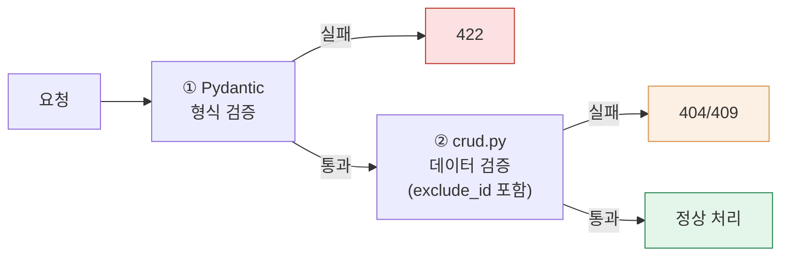

## 7. 유효성 검사 기술 명세

### 7-1. 규칙표

| 대상 | 규칙 | 통과 예 | 실패 예(→422) |
|---|---|---|---|
| username | `^[a-z0-9]{4,20}$` | happyday | abc, HappyDay1 |
| password | 4~20자 | pass1234 | abc |
| name | 1~5자 | 윤아 | (빈 값), 가나다라마바 |
| phone | `^010\d{8}$` | 01012345678 | 010-1234-5678, 01112345678 |
| addr | 검증 없음 | — | — |
| 카테고리명 | 1~10자 | 동호회 | (빈 값), 11자 이상 |

### 7-2. Pydantic 스키마

```python
class SignupIn(BaseModel):
    username: str = Field(pattern=r"^[a-z0-9]{4,20}$")
    password: str = Field(min_length=4, max_length=20)

class ContactCreate(BaseModel):
    name: str = Field(min_length=1, max_length=5)
    phone: str = Field(pattern=r"^010\d{8}$")
    addr: str = ""
    category_id: int

class ContactUpdate(BaseModel):
    name: str | None = Field(default=None, min_length=1, max_length=5)
    phone: str | None = Field(default=None, pattern=r"^010\d{8}$")
    addr: str | None = None
    category_id: int | None = None
```

> ⚠️ **crud.py 중복 확인 함수 — `exclude_id` 반영 (신규, §4-3과 동일 이슈의 실제 코드)**:
>
> ```python
> # crud.py
> def phone_exists(db: Session, user_id: int, phone: str, exclude_id: int | None = None) -> bool:
>     stmt = select(models.Contact).where(
>         models.Contact.user_id == user_id,
>         models.Contact.phone == phone,
>     )
>     if exclude_id is not None:
>         stmt = stmt.where(models.Contact.id != exclude_id)
>     return db.scalar(stmt) is not None
>
> # routers/contacts.py — 추가(FR-05)는 exclude_id 없이 호출
> if crud.phone_exists(db, user.id, data.phone):
>     raise HTTPException(409, "이미 등록된 전화번호입니다")
>
> # routers/contacts.py — 수정(FR-07)은 자기 자신을 exclude
> if data.phone is not None and crud.phone_exists(db, user.id, data.phone, exclude_id=contact.id):
>     raise HTTPException(409, "이미 등록된 전화번호입니다")
> ```
>
> `category_name_exists`도 동일한 패턴으로 구현한다(FR-11에서 `exclude_id=category.id`로 호출).

### 7-3. 검증 2계층 구조

| 계층 | 판단 기준 | 처리 주체 | 실패 |
|---|---|---|---|
| ① 형식 검증 | 입력 단독 판단 가능 | Pydantic 자동 | 422 |
| ② 데이터 검증 | DB 조회 필요 | crud.py 코드 | 404/409 |


