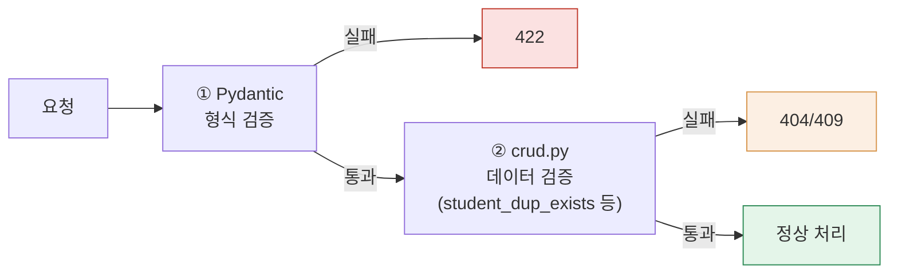

## 7. 유효성 검사 기술 명세

> toyo 프로젝트 신규 유효성 검사 명세다. 기준 문서(`7.유효성검사기술명세(기존).md`)의 구조(규칙표 → Pydantic 스키마 → 검증 2계층)를 그대로 따르되, 규칙 자체는 toyo의 실제 DB 컬럼 정의(`toyo테이블스키마DB_덤프.sql`)와 기존 화면의 JS/PHP 검증 코드(`phpcssjs소스.zip`)를 그대로 근거로 삼았다. 임의로 만든 규칙은 없다.

### 7-1. 규칙표

| 대상 | 규칙 | 통과 예 | 실패 예(→422) |
|---|---|---|---|
| 교사 ID | `^\d{7}$` | 0101234 | 12345(6자리), abc1234 |
| 교사 비밀번호 | 4~20자 | pass1234 | abc |
| 학생 이름 | 공백 제거 후 2~20자 | 김민준 | ㅁ, (빈 값), 공백만 입력 |
| 학년(GRADE) | `^[1-6]$` (초1~초6) | 3 | 0, 7 |
| 성별(SEX) | `^[MF]$` | M | 남, 1 |
| 반(BAN) | `^\d{3}$` | 003 | 3, A03 |
| 학부모 휴대폰 | `^01[016789]\d{7,8}$` (11자리 숫자) | 01012345678 | 010-1234-5678, 021234567 |
| 학부모 이름 | 1~20자 | 김철수 | (빈 값), 21자 이상 |

> ⚠️ **기존(PHP) 방식과의 차이 — 학부모 휴대폰**: 기존 JS는 `document.form['PARENTS_NO_HP_ENC[]'].value.replace(/\s/g,"").length != 11` 로 **자릿수만** 검사했다. `"01012345678"`뿐 아니라 `"99912345678"`처럼 010/011로 시작하지 않는 11자리 숫자도 그대로 통과되어 저장(AES 암호화)됐다. 신규 설계는 자릿수 대신 실제 이동통신 국번(010/011/016~019) 접두 정규식으로 강화한다.
>
> ⚠️ **기존(PHP) 방식과의 차이 — 교사 비밀번호**: 기존 `loginForm.php`는 `PASSWD.value.length == ""`(빈 값 여부)만 검사했다. 최소 길이·최대 길이(폼상 `maxlength=10`) 외 별도 복잡도 규칙이 없었다. 신규 설계에서 최소 길이 규칙을 명시적으로 도입한다.

---

### 7-2. Pydantic 스키마

```python
class TeacherLoginIn(BaseModel):
    id: str = Field(pattern=r"^\d{7}$")
    password: str = Field(min_length=4, max_length=20)

class StudentCreate(BaseModel):
    ban: str = Field(pattern=r"^\d{3}$")
    stud_name: str = Field(min_length=2, max_length=20)
    grade: str = Field(pattern=r"^[1-6]$")
    sex: str = Field(pattern=r"^[MF]$")
    parents_no_hp: str = Field(pattern=r"^01[016789]\d{7,8}$")
    parents_name: str = Field(min_length=1, max_length=20)

class StudentUpdate(BaseModel):
    ban: str | None = Field(default=None, pattern=r"^\d{3}$")
    stud_name: str | None = Field(default=None, min_length=2, max_length=20)
    grade: str | None = Field(default=None, pattern=r"^[1-6]$")
    sex: str | None = Field(default=None, pattern=r"^[MF]$")
    parents_no_hp: str | None = Field(default=None, pattern=r"^01[016789]\d{7,8}$")
    parents_name: str | None = Field(default=None, min_length=1, max_length=20)
```

> ⚠️ **crud.py 중복 확인 함수 — `exclude_id` 반영 (기존 시스템의 실제 중복확인 쿼리를 그대로 이식)**:
>
> 기존 `banStudInfoNewRegModifyProc.php`는 `STUD_NAME + GRADE + SEX + USE_YN='Y'` 조합이 같고 `STUD_NO`만 다른 행이 있는지를 검사했다(동명이인이라도 학년·성별까지 같으면 중복으로 간주). 신규 설계는 이 로직을 코드로 그대로 옮기되, `exclude_id`(자기 자신 제외) 패턴으로 등록/수정 양쪽에 재사용한다.
>
> ```python
> # crud.py
> def student_dup_exists(
>     db: Session, stud_name: str, grade: str, sex: str, exclude_stud_no: str | None = None
> ) -> bool:
>     stmt = select(models.Student).where(
>         models.Student.stud_name == stud_name,
>         models.Student.grade == grade,
>         models.Student.sex == sex,
>         models.Student.use_yn == "Y",
>     )
>     if exclude_stud_no is not None:
>         stmt = stmt.where(models.Student.stud_no != exclude_stud_no)
>     return db.scalar(stmt) is not None
>
> # routers/students.py — 신규 등록(exclude 없이 호출)
> if crud.student_dup_exists(db, data.stud_name, data.grade, data.sex):
>     raise HTTPException(409, "동일 학년·성별에 이미 등록된 이름입니다")
>
> # routers/students.py — 정보 수정(자기 자신을 exclude)
> if crud.student_dup_exists(db, data.stud_name, data.grade, data.sex, exclude_stud_no=student.stud_no):
>     raise HTTPException(409, "동일 학년·성별에 이미 등록된 이름입니다")
> ```

> ⚠️ **기존(PHP) 방식과의 차이 — 학생번호(STUD_NO) 채번**: 기존 시스템은 `SELECT LPAD(MAX(STUD_NO)+1,5,0)`로 다음 번호를 계산한 뒤 별도 INSERT를 실행했다(`banStudInfoNewRegProc.php`). 두 교사가 신규 등록을 동시에 제출하면 같은 `STUD_NO`를 계산해 충돌할 수 있는 **MAX+1 경쟁 조건**이다. 신규 설계는 `stud_no`를 진짜 `AUTO_INCREMENT`(또는 `SEQUENCE`) 컬럼으로 선언해 DB가 값을 발급하게 하고, 애플리케이션은 값을 계산하지 않는다.

---

### 7-3. 검증 2계층 구조

| 계층 | 판단 기준 | 처리 주체 | 실패 |
|---|---|---|---|
| ① 형식 검증 | 입력 단독 판단 가능 | Pydantic 자동 | 422 |
| ② 데이터 검증 | DB 조회 필요 | crud.py 코드 | 404/409 |



> 💡 기존 시스템에는 이 2계층 구분이 없었다. `banStudInfoNewRegModifyProc.php`는 형식 검증(빈 값 여부 등)과 데이터 검증(중복 확인 쿼리)이 같은 파일, 같은 흐름 안에 섞여 있었고 실패 시 응답도 `alert()` + `history.go(-1)` 하나뿐이라 422와 409를 구분할 방법이 없었다. 신규 설계는 실패 원인에 따라 상태코드를 분리해, 화면단이 "입력을 고쳐야 하는지(422)" "이미 존재해서 안 되는지(409)"를 구분해 안내할 수 있게 한다.
