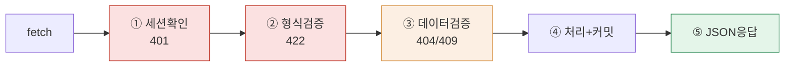
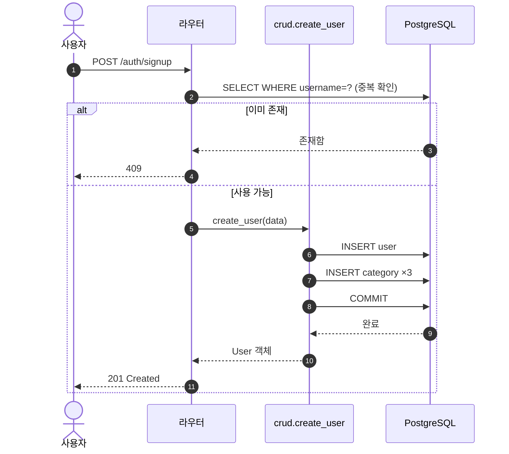
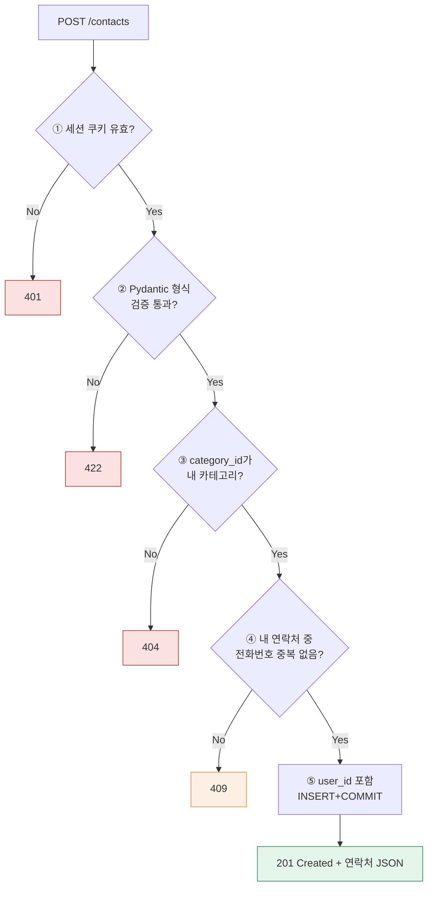
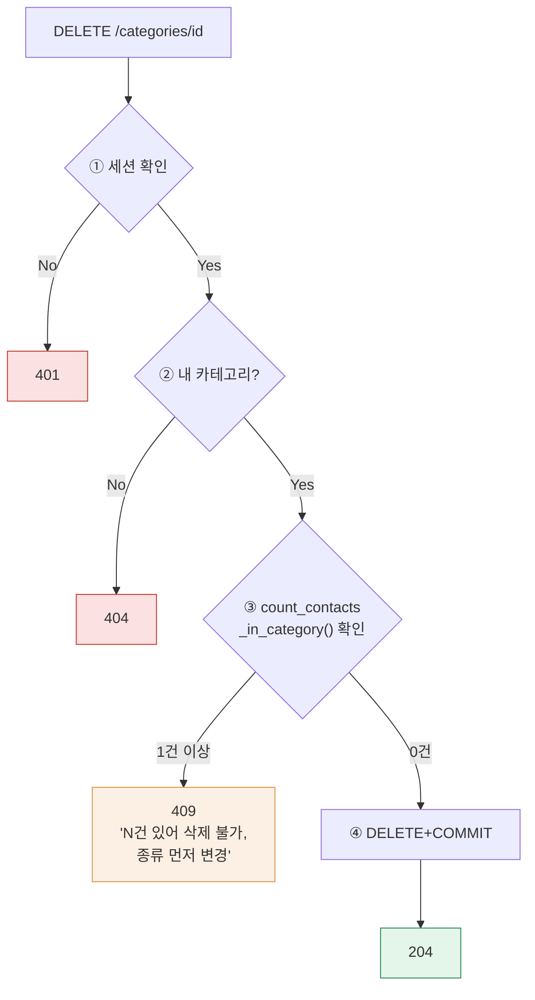

## 8. 단계별 워크플로우

### 8-1. 공통 처리 파이프라인 (FR-05~12)

①은 인증 필수 API에만, ③은 본문 있는 요청(POST/PATCH)에만 적용. 어느 단계든 실패 시 이후 단계 미실행, 즉시 오류 응답(500 미발생의 구조적 근거).

### 8-2. 시퀀스 — 회원가입

### 8-3. 시퀀스 — 연락처 추가(대표)

### 8-4. 시퀀스 — 카테고리 삭제(대표 엣지 케이스)

DB의 FK(RESTRICT)가 최종 안전망이나, 애플리케이션에서 선제적으로 count 확인 후 친절한 409로 응답하는 것이 핵심 요구(PR-09)다. FK 위반을 그대로 노출하면 500이 되어 원인 전달이 불가능하다.