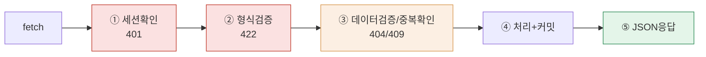
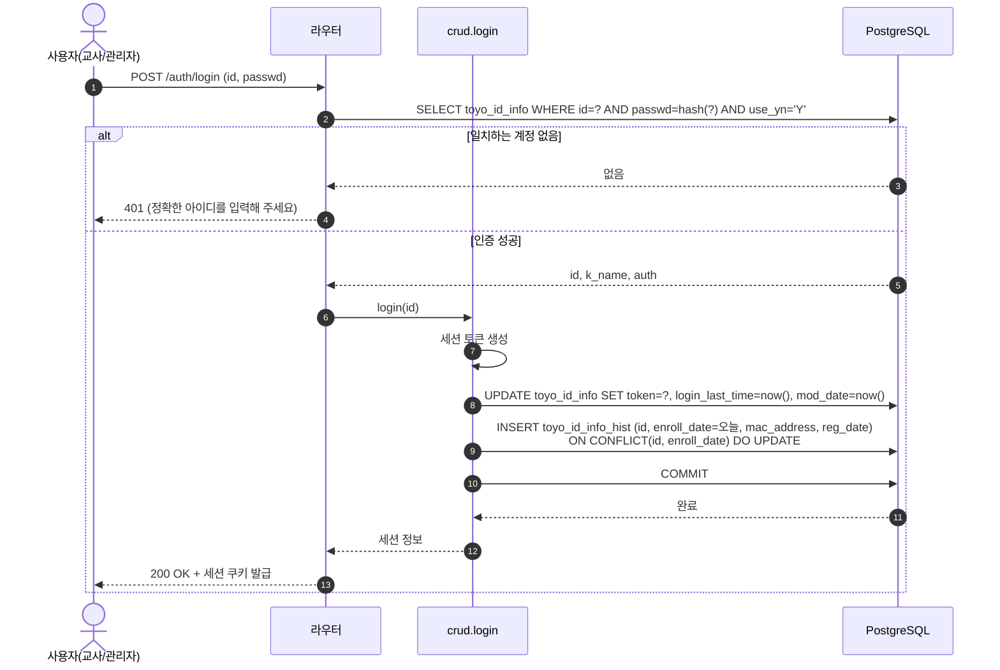
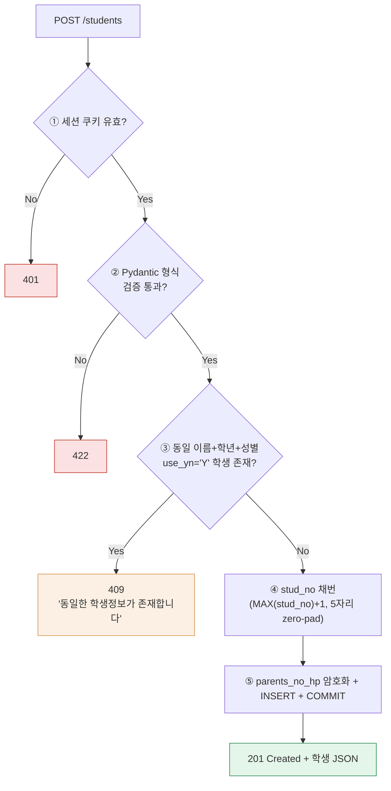
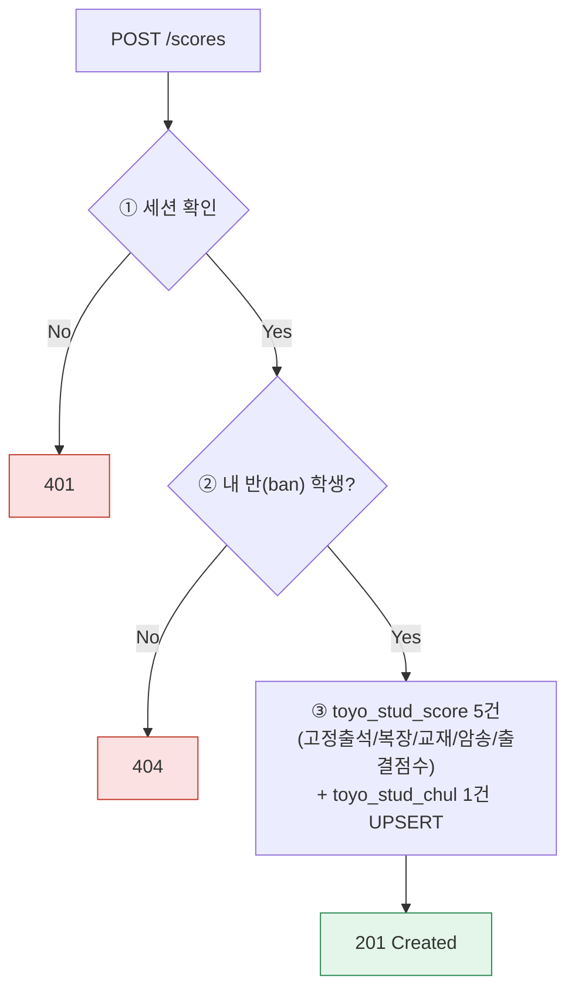

## 8. 단계별 워크플로우 (toyo 프로젝트)

> 아래 흐름은 레거시 PHP 소스(`loginFormProc.php`, `banStudInfoNewRegProc.php`, `banScoreRegProc.php` 등)를 실제로 분석해서, 그 안에 담긴 **업무 로직**을 신규 FastAPI/SQLAlchemy(PostgreSQL 16) 구조에 맞춰 재설계한 것입니다. 레거시의 구현 방식(문자열 조합 SQL, 세션 처리 등)을 그대로 옮기는 게 아니라, 레거시가 지키던 **업무 규칙**만 추출해 정확한 흐름으로 재구성했습니다.

### 8-1. 공통 처리 파이프라인

①은 인증 필수 API(관리자/교사 로그인 이후)에만, ③은 본문 있는 요청(POST/PATCH)에만 적용. 어느 단계든 실패 시 이후 단계 미실행, 즉시 오류 응답.

**레거시 → 신규 전환 시 반드시 보강해야 할 지점 (20년차 설계자 관점)**

| 레거시 방식 | 문제 | 신규 설계 |
|---|---|---|
| `$_SESSION[TOKEN]`을 PHP 세션에 저장, 별도 만료 로직 없음 | 세션 하이재킹/무기한 로그인 위험 | FastAPI 세션 쿠키 + 서버측 만료(TTL) 관리 |
| 비밀번호 `MD5('$PASSWD')` | MD5는 크랙 가능한 해시, 솔트 없음 | `bcrypt`/`argon2`로 재해싱, 최초 로그인 시 마이그레이션 |
| `AES_ENCRYPT(컬럼, 'dlsejr00**')` — 암호화 키가 소스코드에 하드코딩 | 키 유출 시 전체 개인정보(`parents_no_hp_enc`, `ban_hp_enc`) 노출 | 키는 환경변수/시크릿 매니저로 분리, 애플리케이션 레벨 암호화로 전환 |
| SQL을 문자열로 직접 조합(`'$_POST[ID]'`) | SQL Injection 위험 | SQLAlchemy 파라미터 바인딩으로 원천 차단 |

---

### 8-2. 시퀀스 — 로그인 (레거시 `loginFormProc.php` 기준)

레거시는 로그인 성공 시 `TOYO_NOTICE_INFO`에서 게시기간 중인 공지를 조회해 `alert()`로 띄우는 로직도 포함되어 있었으나, 이는 UI 관심사이므로 신규 설계에서는 `GET /notices/active`로 별도 분리한다.

---

### 8-3. 시퀀스 — 학생 신규 등록 (레거시 `banStudInfoNewRegProc.php` 기준, 대표)

**레거시 로직 중 신규 설계에서 반드시 고쳐야 하는 부분**

- `stud_no`를 `SELECT MAX(stud_no)+1`로 채번 — 동시에 두 명이 등록하면 같은 번호가 발급되는 **경쟁 조건(race condition)**이 있다. 신규 설계에서는 PostgreSQL `SEQUENCE` 또는 `SELECT ... FOR UPDATE`로 채번을 원자적으로 처리해야 한다.
- 중복 검사가 "이름+학년+성별" 3개 조합만 보는데, 동명이인이 흔한 경우 오탐(false positive)이 날 수 있다 — 정책을 그대로 유지할지, 생년월일 등을 추가할지는 별도 확인이 필요하다.

---

### 8-4. 시퀀스 — 점수/출결 등록 및 삭제 정책 (엣지 케이스)

레거시는 `toyo_stud_score`(PK: `enroll_date`+`ban`+`stud_no`+`subject`)에 동일 건을 두 번 등록하면 **PK 충돌로 실패**한다(재등록/수정 처리가 없었다). 신규 설계에서는 `INSERT ... ON CONFLICT (enroll_date, ban, stud_no, subject) DO UPDATE`로 바꿔서, 담당 교사가 점수를 실수로 다시 등록해도 덮어쓰기가 되도록 하는 것을 권장한다.

**삭제(DELETE) 정책 — 레거시와 신규 스키마의 근본적 차이**

레거시 PHP 소스 전체(약 280개 파일)를 확인한 결과, `toyo_*` 테이블에 대한 실제 `DELETE FROM` 구문은 **단 한 건도 없었다**. 모든 "삭제"는 `USE_YN = 'N'`으로 갱신하는 **소프트 삭제**만 사용했고, 물리적 레코드 삭제는 발생한 적이 없다.

반면 신규 스키마는 결정하신 대로 **전체 FK가 `ON DELETE CASCADE`**로 되어 있다. 이는 레거시에는 없던 물리 삭제 기능을 신규 시스템에 새로 추가하는 것이므로, 아래 원칙을 명시해 둘 필요가 있다.

| 삭제 유형 | 적용 대상 | 동작 |
|---|---|---|
| **소프트 삭제 (기본, 레거시와 동일)** | 학생/반/교사 등 대부분의 일반 CRUD | `use_yn`을 `'N'`으로 UPDATE, 물리 레코드는 유지 |
| **하드 삭제 (신규 추가 기능, 관리자 전용)** | 데이터 정리가 필요한 관리자 작업 | 실제 `DELETE` 실행 → `ON DELETE CASCADE`로 자식 레코드까지 DB 레벨에서 연쇄 삭제됨 |

하드 삭제 API는 `toyo_stud_info` 같은 상위 테이블 하나만 지워도 `toyo_stud_score`, `toyo_stud_chul`, `toyo_stud_dream` 등 다수 테이블이 연쇄로 사라지므로, **관리자 권한 확인 + 삭제 전 확인(confirm) 절차**를 반드시 넣는 것을 권장한다. RESTRICT처럼 애플리케이션이 사전에 자식 건수를 세어 409로 막는 방식은 이번 CASCADE 정책상 적용하지 않는다.
