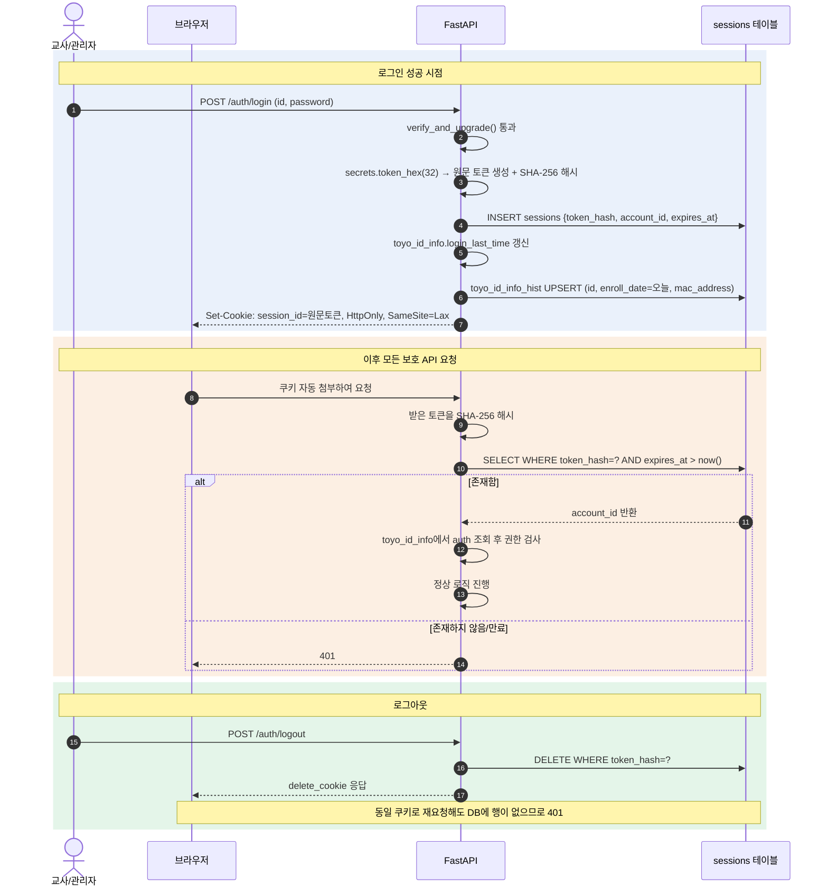

# 토요하자TRD — A-1. 로그인화면

> 마스터 문서(`토요하자TRD(신규)`)에서 로그인화면 구현에 필요한 내용만 추출·재구성했다. §3-2(DDL, 레거시 구조 유지)를 기준으로 하되, 세션 저장 방식은 §5/§3-3에서 공통 지적한 보안 문제(토큰 평문 저장)를 반영해 별도 `sessions` 테이블(해시 토큰)을 사용한다.

## 1. 데이터 구조

```sql
-- 계정 (레거시 toyo_id_info 그대로 유지)
CREATE TABLE toyo_id_info (
    id VARCHAR(20),
    passwd VARCHAR(64) NOT NULL,       -- 최초엔 레거시 MD5(32자리), 로그인 시점에 Argon2로 순차 전환
    k_name VARCHAR(64) NOT NULL,
    use_yn VARCHAR(1),
    ssn VARCHAR(4),                     -- 생년월일 MMDD (실제 주민번호 아님, 메인화면 TRD에서 사용)
    token VARCHAR(200),                 -- 레거시 호환용 컬럼, 신규 로직은 사용하지 않음(아래 sessions 테이블 사용)
    auth VARCHAR(2),                    -- 권한 레벨 문자열(0~8), 정수로 정규화해 사용
    login_first_time TIMESTAMP,
    login_last_time TIMESTAMP,
    reg_date TIMESTAMP,
    reg_id VARCHAR(30),
    mod_date TIMESTAMP,
    mod_id VARCHAR(30),
    id_img_path VARCHAR(200),
    id_img_name VARCHAR(200),
    group_code VARCHAR(2),
    teacher_hp_no_enc BYTEA,
    CONSTRAINT pk_toyo_id_info PRIMARY KEY (id)
);

-- 로그인 이력 (레거시 toyo_id_info_hist 그대로 유지 — 일자 단위 1건, upsert)
CREATE TABLE toyo_id_info_hist (
    id VARCHAR(20),
    enroll_date VARCHAR(8),
    mac_address VARCHAR(100),
    reg_date TIMESTAMP,
    reg_id VARCHAR(30),
    mod_date TIMESTAMP,
    mod_id VARCHAR(30),
    CONSTRAINT pk_toyo_id_info_hist PRIMARY KEY (id, enroll_date)
);
ALTER TABLE toyo_id_info_hist ADD CONSTRAINT fk_toyo_id_info_hist_id
    FOREIGN KEY (id) REFERENCES toyo_id_info (id) ON DELETE RESTRICT;

-- 로그인 세션 (신규 — 레거시엔 없던 개념. 로그인마다 독립된 행 = DELETE 즉시 무효화)
CREATE TABLE sessions (
    id SERIAL PRIMARY KEY,
    token_hash VARCHAR(64) NOT NULL UNIQUE,   -- 원문 토큰의 SHA-256 해시만 저장(레거시는 평문 저장했음)
    account_id VARCHAR(20) NOT NULL REFERENCES toyo_id_info (id) ON DELETE RESTRICT,
    expires_at TIMESTAMP NOT NULL,
    created_at TIMESTAMP DEFAULT now()
);
```

`AUTH` 권한 레벨 정규화표(레거시 `TOYO_ID_INFO.AUTH` 문자열 → 정수):

| auth_level | 레거시 라벨 |
|---|---|
| 0 | 보조교사 |
| 1 | 꿈땅교사 |
| 2 | 게임디렉터 |
| 5 | (담임/임원)교사 |
| 6 | (불티/티엔티)팀장 |
| 7 | 교역자/부장/행정 |
| 8 | 전산팀(최고 권한) |

(값 사이 공백(3, 4)은 향후 확장 여지로 유지. `GROUP_CODE`는 권한이 아닌 소속 조직 구분 값이므로 `auth_level`과 혼용하지 않는다.)

## 2. 인증 방식

세션 쿠키 채택(JWT 미채택) — toyo는 교사·관리자만 로그인하는 폐쇄형 백오피스로 외부 API·모바일 연동 계획이 없어, JWT의 무상태·크로스도메인 이점이 실익으로 이어지지 않는다.

```python
# security.py
from pwdlib import PasswordHash

password_hash = PasswordHash.recommended()  # Argon2

def hash_password(plain: str) -> str:
    return password_hash.hash(plain)

def verify_password(plain: str, hashed: str) -> bool:
    return password_hash.verify(plain, hashed)
```

**레거시 계정 마이그레이션(지연 재해시)** — 기존 교사 계정을 일괄 초기화하면 운영 혼선이 크므로, 로그인 시점에 자동 전환한다.

```python
import hashlib

def verify_and_upgrade(plain: str, stored: str, teacher_id: str, db: Session) -> bool:
    if len(stored) == 32:  # 레거시 MD5 해시(32자리 hex)로 판단
        if hashlib.md5(plain.encode()).hexdigest() != stored:
            return False
        db.execute(
            update(models.ToyoIdInfo)
            .where(models.ToyoIdInfo.id == teacher_id)
            .values(passwd=hash_password(plain))
        )
        db.commit()
        return True
    return verify_password(plain, stored)
```

## 3. 세션 발급/검증 흐름



`get_current_teacher` 및 관리자 전용 의존성:

```python
def get_current_teacher(
    session_id: str | None = Cookie(default=None),
    db: Session = Depends(get_db),
) -> models.ToyoIdInfo:
    if session_id is None:
        raise HTTPException(401, "로그인이 필요합니다")
    token_hash = hashlib.sha256(session_id.encode()).hexdigest()
    session = db.scalar(select(models.Session).where(models.Session.token_hash == token_hash))
    if session is None or session.expires_at < datetime.now():
        raise HTTPException(401, "로그인이 필요합니다")
    return db.get(models.ToyoIdInfo, session.account_id)

def require_auth_level(min_level: int):
    def checker(teacher: models.ToyoIdInfo = Depends(get_current_teacher)) -> models.ToyoIdInfo:
        if int(teacher.auth) < min_level:
            raise HTTPException(403, "권한이 없습니다")
        return teacher
    return checker
```

> ⚠️ **레거시와의 결정적 차이**: 레거시는 로그인 여부·권한 확인이 메뉴 화면(`menuSelect.php`)에만 있었고, 실제 쓰기를 수행하는 `~Proc.php` 파일들은 세션 검사를 아예 하지 않았다(URL을 직접 알면 로그인 없이도 데이터 수정 가능). 신규 설계는 **모든 쓰기 라우터에 `get_current_teacher`(또는 `require_auth_level`) 의존성을 코드 리뷰 필수 항목으로 강제**해 구조적으로 차단한다.

## 4. 유효성 검사

| 대상 | 규칙 | 통과 예 | 실패 예(→422) |
|---|---|---|---|
| 교사 ID | `^\d{7}$` | 0101234 | 12345(6자리), abc1234 |
| 교사 비밀번호 | 4~20자 | pass1234 | abc |

```python
class TeacherLoginIn(BaseModel):
    id: str = Field(pattern=r"^\d{7}$")
    password: str = Field(min_length=4, max_length=20)
```

> ⚠️ 레거시(`loginForm.php`)는 비밀번호 빈 값 여부만 검사했다(최소 길이 규칙 없음). 신규 설계에서 최소 길이 규칙을 명시적으로 도입한다.

## 5. 보안 고려사항

| 항목 | 규칙 | 근거 |
|---|---|---|
| 쿠키 HttpOnly | 설정 | JS의 쿠키 접근 차단, XSS 세션 탈취 방지 |
| 쿠키 SameSite | `Lax` 이상 | CSRF 위험 완화(레거시는 속성 자체가 없었음) |
| 로그인 실패 응답 | 동일 문구로 통일 | 계정 열거(enumeration) 공격 방지 |
| 비밀번호 저장 | Argon2 해시만(레거시 MD5는 순차 폐기) | DB 유출 시에도 원문 비노출 |
| 세션 토큰 저장 | 해시(SHA-256)만 저장, 원문은 응답에만 1회 전달 | 레거시는 `TOKEN` 컬럼에 평문 저장 |

## 6. 상태 코드

| 코드 | 발생 상황 |
|---|---|
| 401 | 세션 없음/무효/만료, 로그인 아이디·비밀번호 불일치 |
| 409 | 로그인 계정 `use_yn='N'`(비활성 계정) |
| 422 | ID/비밀번호 형식 위반 |

```python
account = crud.get_id_info(db, data.id)
if account is None or not verify_and_upgrade(data.password, account.passwd, account.id, db):
    raise HTTPException(status_code=401, detail="아이디 또는 비밀번호가 올바르지 않습니다")
if account.use_yn != "Y":
    raise HTTPException(status_code=409, detail="비활성화된 계정입니다. 관리자에게 문의해 주세요")
```

## 7. 인수기준(AC) — 코드 검증 기반

| AC | 내용 | 근거 파일 |
|---|---|---|
| AC-01 | ID+비밀번호 일치 & `USE_YN='Y'` 인 계정만 로그인 성공 | `loginFormProc.php` |
| AC-02 | 로그인 실패(아이디/비번 불일치, 또는 `USE_YN≠'Y'`) 시 동일 문구로 안내(계정 존재 여부 미노출) | `loginFormProc.php` |
| AC-03 | 로그인 성공 시 `TOYO_ID_INFO_HIST`에 (ID, 당일 ENROLL_DATE) 기준 접속이력 upsert | `loginFormProc.php` |
| AC-04 | 세션ID 없음 / 토큰 없음 / 토큰 불일치 — 각각 다른 문구로 안내 후 로그인 화면으로 강제 이동 | `dbconfig.php` |
| AC-12 | 로그아웃 시 세션 파기 후 이후 보호된 화면 접근은 AC-04 기준으로 재차단 | `logoutFormProc.php` |

## 8. 테스트 시나리오

| TC | 입력/행위 | 기대 결과 | 대응 AC |
|---|---|---|---|
| TC-01 | 등록된 ID + 올바른 비밀번호로 로그인 | 메뉴 화면 이동, 세션 쿠키 발급 | AC-01 |
| TC-02 | 존재하지 않는 ID로 로그인 | "정확한 아이디를 입력해 주세요" 안내, 입력화면 유지 | AC-02 |
| TC-03 | 존재하는 ID + 틀린 비밀번호로 로그인 | TC-02와 동일한 문구로 안내(사유 구분 없음) | AC-02 |
| TC-04 | `USE_YN='N'`으로 비활성화된 ID로 로그인 | 로그인 실패 처리 | AC-02 |
| TC-05 | 로그인 성공 직후 `TOYO_ID_INFO_HIST` 확인 | (ID, 당일 ENROLL_DATE) 행이 없으면 INSERT, 있으면 UPDATE | AC-03 |
| TC-06 | 로그인하지 않은 상태로 보호 화면 직접 접속 | "로그인이 필요합니다" 안내 후 로그인 화면 이동 | AC-04 |
| TC-07 | 세션 쿠키는 있으나 서버 DB에 해당 세션이 없는 상태에서 접근 | 401 후 로그인 화면 이동 | AC-04 |
| TC-08 | 다른 브라우저에서 같은 계정으로 재로그인 후, 기존 브라우저에서 계속 사용 | 신규 설계는 세션을 로그인별 독립 행으로 관리하므로, 기존 세션이 만료 전이면 동시 로그인이 허용됨(레거시는 TOKEN 덮어쓰기로 기존 세션을 강제 종료했음 — 동시 로그인 허용 여부는 별도 정책 확인 필요) | AC-04 |
| TC-19 | 로그아웃 실행 후 뒤로가기(브라우저 캐시)로 직전 보호 화면 재접근 | 캐시된 화면이 보이더라도 실제 데이터 조회/등록 액션은 AC-04 기준으로 재차단 | AC-12 |

> ⚠️ **TC-08 관련 확인 필요**: 레거시는 계정당 TOKEN이 1개뿐이라 재로그인 시 기존 세션이 자동 무효화됐다(동시 로그인 불가). 신규 설계(세션을 별도 행으로 관리)는 구조적으로 동시 로그인이 가능해진다 — 이 정책 변경이 의도한 것인지 확인 필요.
