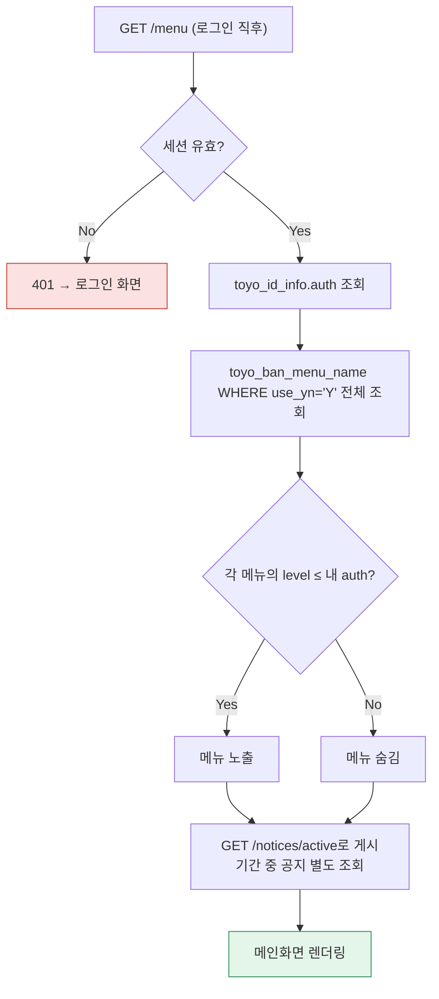

# 토요하자TRD — A-2. 메인화면

> 마스터 문서에서 로그인 직후 진입하는 메인/메뉴 화면 관련 내용만 추출·재구성했다. 레거시의 `menuSelect.php`/`topMenuInclude.php`를 코드로 검증한 결과를 기준으로 한다.

## 1. 데이터 구조

```sql
-- 메뉴 마스터 (레거시 toyo_ban_menu_name 그대로 유지)
CREATE TABLE toyo_ban_menu_name (
    menu VARCHAR(2),
    menu_name VARCHAR(100),
    src_name VARCHAR(100),
    order_by VARCHAR(2),
    mobile_order_by VARCHAR(2),
    level VARCHAR(1),              -- 이 메뉴를 볼 수 있는 최소 AUTH 레벨
    group_no VARCHAR(2),
    use_yn VARCHAR(1),
    mobile_use_yn VARCHAR(1),
    menu_code VARCHAR(2),
    reg_date TIMESTAMP,
    reg_id VARCHAR(30),
    mod_date TIMESTAMP,
    mod_id VARCHAR(30),
    go_but_yn VARCHAR(1),
    go_but_nm VARCHAR(20),
    go_but_order_by VARCHAR(2),
    mobile_menu_name VARCHAR(100),
    mobile_but_yn VARCHAR(1),
    mobile_but_nm VARCHAR(20),
    mobile_but_order_by VARCHAR(2),
    CONSTRAINT pk_toyo_ban_menu_name PRIMARY KEY (menu)
);

-- 공지사항 (레거시 toyo_notice_info 그대로 유지, 메인화면 진입 시 게시기간 중인 공지 노출)
CREATE TABLE toyo_notice_info (
    notice_no VARCHAR(5),
    title VARCHAR(200) NOT NULL,
    contents VARCHAR(4000) NOT NULL,
    notice_start_date VARCHAR(8),
    notice_end_date VARCHAR(8),
    use_yn VARCHAR(1),
    reg_date TIMESTAMP,
    reg_id VARCHAR(30),
    mod_date TIMESTAMP,
    mod_id VARCHAR(30),
    CONSTRAINT pk_toyo_notice_info PRIMARY KEY (notice_no)
);
```

## 2. 메뉴 노출 로직



```python
def list_visible_menus(db: Session, auth_level: int) -> list[models.ToyoBanMenuName]:
    return db.scalars(
        select(models.ToyoBanMenuName)
        .where(models.ToyoBanMenuName.use_yn == "Y")
        .where(cast(models.ToyoBanMenuName.level, Integer) <= auth_level)
        .order_by(models.ToyoBanMenuName.order_by)
    ).all()

def get_active_notices(db: Session) -> list[models.ToyoNoticeInfo]:
    today = date.today().strftime("%Y%m%d")
    return db.scalars(
        select(models.ToyoNoticeInfo)
        .where(models.ToyoNoticeInfo.use_yn == "Y")
        .where(models.ToyoNoticeInfo.notice_start_date <= today)
        .where(models.ToyoNoticeInfo.notice_end_date >= today)
    ).all()
```

> ⚠️ **레거시와의 차이**: 레거시는 로그인 성공 시점에 `TOYO_NOTICE_INFO`를 조회해 `alert()`로 공지를 띄우는 로직이 로그인 처리(`loginFormProc.php`) 안에 섞여 있었다. 이는 UI 관심사이므로 신규 설계에서는 `GET /notices/active`로 별도 엔드포인트를 분리하고, 메인화면 진입 시 프론트엔드가 호출한다.

## 3. 화면 구성 (SCR-001, 참고: 원본 문서에 이 화면의 상세 UI 명세는 없어 §13 UI 설계 패턴을 준용해 구성함)

- 상단: 서비스명, 로그인한 교사명(`k_name`), 담당 반 표시, [로그아웃]
- 중단: 공지사항 배너(게시기간 중인 것만, `title` 클릭 시 `contents` 펼침)
- 좌측/본문: `auth_level`에 따라 노출되는 메뉴 목록(`toyo_ban_menu_name.menu_name`, 클릭 시 각 기능 화면으로 이동)
- 하단: SCR-900 공통 메시지 영역(다른 TRD와 공통)

| 요소 | 동작 | 호출 API | 성공 시 반응 |
|---|---|---|---|
| 메뉴 항목 클릭 | 클릭 | (라우팅만, API 호출 없음) | 해당 기능 화면으로 이동 |
| 공지 배너 | 자동 표시 | GET /notices/active | 게시기간 중 공지만 노출 |
| [로그아웃] | 클릭 | POST /auth/logout | 로그인화면(SCR-000)으로 전환 |

## 4. 인수기준(AC) — 코드 검증 기반

| AC | 내용 | 근거 파일 |
|---|---|---|
| AC-10 | 메뉴 노출은 `$_SESSION['AUTH']`(숫자 문자열) 값과 메뉴별 `LEVEL`을 비교해 결정(`AUTH≥LEVEL`일 때만 노출) | `topMenuInclude.php`, `menuSelect.php` |

## 5. 테스트 시나리오

| TC | 입력/행위 | 기대 결과 | 대응 AC |
|---|---|---|---|
| TC-16 | `AUTH="9"`(관리자에 준하는 최고값) 계정으로 로그인 후 전체 메뉴 노출 확인 | LEVEL 제한과 무관하게 모든 메뉴 노출 | AC-10 |
| TC-17 | AUTH 낮은 일반 교사 계정으로 로그인 후 메뉴 목록 확인 | 자신의 AUTH 값보다 LEVEL이 높은 메뉴는 화면에 노출되지 않음 | AC-10 |

> 참고: `AUTH="9"`는 A-1(로그인화면)에서 정규화한 0~8 레벨 표에 없는 값이다. A-3(교사출결)의 AC-21에서도 "AUTH<9는 최고관리자 제외" 조건이 등장하는 것으로 보아, 9는 시스템 최상위(전산팀보다 위) 계정을 가리키는 것으로 추정된다 — 0~8 표에 9를 추가로 반영할지 확인 필요.
