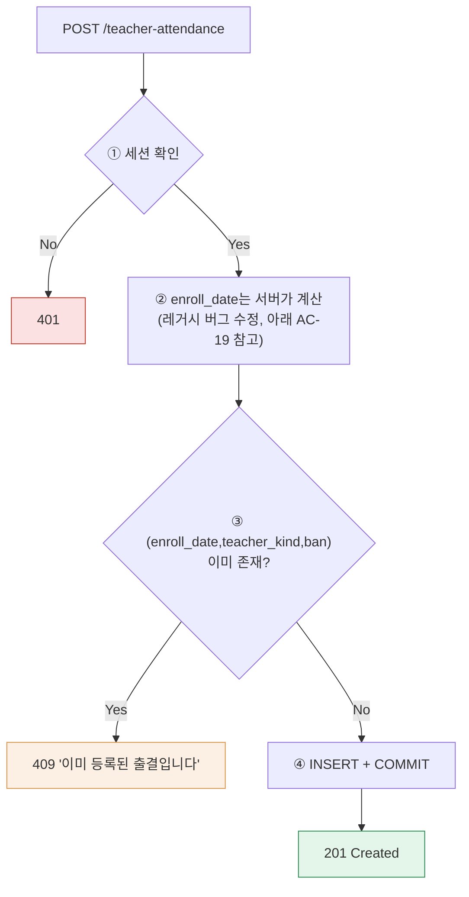
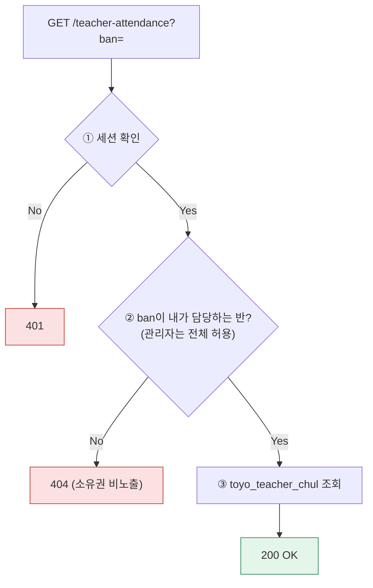

# 토요하자TRD — A-3. 교사출결 등록/수정/리스트

> 마스터 문서에서 교사출결 기능만 추출·재구성했다. `toyo_teacher_chul`은 §3-3(SQLAlchemy 재설계)의 "범위 외" 목록에 명시적으로 포함되어 있어, §3-2 DDL(레거시 구조 유지)만을 근거로 작성했다.

## 1. 데이터 구조

```sql
-- 교사출결 코드(교사구분×반) 마스터
CREATE TABLE toyo_teacher_chul_code_name (
    teacher_kind VARCHAR(2),
    ban VARCHAR(3),
    -- (원본 문서에 이하 컬럼 생략되어 있었음 — teacher_kind_name 등 표시용 컬럼은 실제 덤프 재확인 필요)
    CONSTRAINT pk_toyo_teacher_chul_code_name PRIMARY KEY (teacher_kind, ban)
);
ALTER TABLE toyo_teacher_chul_code_name ADD CONSTRAINT fk_toyo_teacher_chul_code_name_ban
    FOREIGN KEY (ban) REFERENCES toyo_ban_code_name (ban) ON DELETE RESTRICT;

-- 교사출결 등록
CREATE TABLE toyo_teacher_chul (
    enroll_date VARCHAR(8),
    teacher_kind VARCHAR(2),
    ban VARCHAR(3),
    chul_yn VARCHAR(1),
    reason VARCHAR(200),
    reg_date TIMESTAMP,
    reg_id VARCHAR(30),
    mod_date TIMESTAMP,
    mod_id VARCHAR(30),
    CONSTRAINT pk_toyo_teacher_chul PRIMARY KEY (enroll_date, teacher_kind, ban)
);
ALTER TABLE toyo_teacher_chul ADD CONSTRAINT fk_toyo_teacher_chul_ban
    FOREIGN KEY (ban) REFERENCES toyo_ban_code_name (ban) ON DELETE RESTRICT;
ALTER TABLE toyo_teacher_chul ADD CONSTRAINT fk_toyo_teacher_chul_teacher_kind_ban
    FOREIGN KEY (teacher_kind, ban) REFERENCES toyo_teacher_chul_code_name (teacher_kind, ban) ON DELETE RESTRICT;
```

## 2. 함수 명세

| 함수 | 위치 | 입력 | 출력/효과 |
|---|---|---|---|
| create_teacher_attendance(db, teacher_kind, ban, data) | crud/attendance.py | 교사구분+반+출결데이터 | `toyo_teacher_chul` INSERT — "교사출석등록" 메뉴 대응 |
| get_teacher_attendance_status(db, enroll_date) | crud/attendance.py | 일자 | 해당 일자 전체 교사 출결 현황 집계 — "교사출결현황" 메뉴 대응 |
| get_teacher_attendance_in_my_ban(db, ban, enroll_date) | crud/attendance.py | 반+일자 | 담당 반 소속 교사 출결만 조회(소유권 검증, 아래 AC-22 대응) |

## 3. 워크플로우

### 3-1. 등록



### 3-2. 조회(리스트/현황)



> ⚠️ **레거시 결함 재발 방지 (반드시 신규 설계에 반영)**
> 1. **`ENROLL_DATE` 자동 계산 버그**: 레거시(`banTeacherRegProc.php`)는 사용자 입력을 무시하고 서버가 항상 "이번 주 돌아오는 토요일"(`ADDDATE(CURDATE(), 7-DAYOFWEEK(CURDATE()))`)로 계산해 저장했다. 신규 설계에서도 이 "토요일 자동 계산" 업무 규칙 자체는 유지할지, 아니면 사용자가 날짜를 직접 선택하게 할지 **확인이 필요**하다(레거시가 의도한 동작인지, 버그를 그대로 답습한 것인지 불명확).
> 2. **중복 체크 무력화**: 레거시는 `(ENROLL_DATE,TEACHER_KIND,BAN)` 중복 여부를 조회는 하되(`$total`) 그 결과로 분기하지 않아 중복 체크가 사실상 없었다. 신규 설계는 위 흐름도처럼 **409로 실제 차단**한다.
> 3. **에러 무시**: 레거시는 PK 중복으로 DB INSERT가 실패해도 반환값을 검사하지 않아 화면엔 항상 "정상 처리" 메시지만 노출됐다. 신규 설계는 `IntegrityError`를 잡아 정확한 상태 코드(409)로 안내한다.
> 4. **BAN 파라미터 소유권 미검증(IDOR)**: 레거시는 세션이 아닌 폼/URL의 `BAN` 파라미터로 조회 범위를 결정해, 담당하지 않는 반의 데이터도 그대로 노출됐다(교사출결현황 포함). 신규 설계는 흐름도처럼 **서버가 세션의 담당 반과 요청 `ban`을 대조**해야 한다.

## 4. 상태 코드

| 코드 | 발생 상황 |
|---|---|
| 401 | 세션 없음/무효 |
| 404 | 담당 반이 아닌 `ban`으로 조회 시도(존재 여부 비노출) |
| 409 | 동일 `(enroll_date, teacher_kind, ban)` 중복 등록 시도 |
| 422 | 형식 위반 |

```python
# 등록
if crud.teacher_attendance_exists(db, enroll_date, teacher_kind, ban):
    raise HTTPException(status_code=409, detail="이미 등록된 출결입니다")

# 조회 — 담당 반 소유권 검증
if not teacher.is_admin and ban != teacher.ban:
    raise HTTPException(status_code=404, detail="해당 반 정보가 없습니다")
```

## 5. 인수기준(AC) — 코드 검증 기반

| AC | 내용 | 근거 파일 |
|---|---|---|
| AC-19 | 동일 `(ENROLL_DATE,TEACHER_KIND,BAN)` 중복 여부를 조회는 하지만 결과로 분기하지 않아 중복 체크가 사실상 없음. `ENROLL_DATE`는 사용자 입력이 아니라 서버가 "이번 주 돌아오는 토요일"로 자동 계산 | `banTeacherRegProc.php` |
| AC-20 | PK 중복 INSERT 시 DB 에러가 나더라도 반환값을 검사하지 않아 화면엔 항상 "정상 처리" 메시지만 노출됨(에러 무시) | `banTeacherRegProc.php` |
| AC-21 | 교사생일(월): `TOYO_ID_INFO.SSN`(4자리, MMDD)을 기준으로 월별 목록 필터링, `AUTH < 9` 조건으로 최고관리자 계정은 목록에서 제외 (참고: 교사출결과 같은 "교사 관리" 카테고리 화면이라 함께 표기하나 별도 기능임) | `banTeacherBirthList.php` |
| AC-22 | 교사출결현황 등 조회 화면도 세션이 아닌 `$_POST[BAN]` 파라미터로 조회 범위가 결정됨(IDOR 패턴) | `banTeacherChulStatisticsList.php` 외 |

## 6. 테스트 시나리오

| TC | 입력/행위 | 기대 결과 | 대응 AC |
|---|---|---|---|
| TC-28 | 동일 (교사구분, 반) 조합으로 교사출석등록을 연속 2회 제출 | **AS-IS 재현(레거시)**: 1차는 정상 등록, 2차는 PK 중복으로 DB 단 실패에도 화면엔 "정상 등록되었습니다"로 동일 노출. **TO-BE(신규)**: 2차 요청은 409로 명확히 안내 | AC-19, AC-20 |
| TC-29 | 화요일 등 평일에 교사출석등록 제출 | **AS-IS 재현**: 입력값과 무관하게 항상 "이번 주 돌아오는 토요일" 날짜로 저장. 이 규칙을 신규에도 유지할지 확인 필요 | AC-19 |
| TC-32(변형) | 교사A(담당 BAN="101")로 로그인 후 교사출결현황 화면에서 BAN 파라미터를 "102"로 조작 | **AS-IS 재현**: 담당하지 않는 반(102)의 데이터가 그대로 조회됨. **TO-BE**: 404로 차단되어야 함 | AC-22 |

> TC-28/29/32는 AS-IS(레거시) 결함 재현 테스트다. 신규 시스템에서는 위 §3의 흐름도대로 동작해 이 결함들이 재현되지 않아야 하며, 회귀 테스트로 반드시 포함해야 한다.
