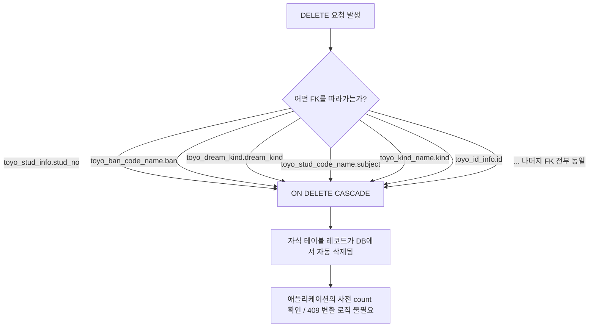

## 설계 포인트 — ON DELETE CASCADE 전체 통일

toyo 스키마의 모든 FK(총 36개, `toyo_ban_code_name`, `toyo_stud_info`, `toyo_dream_kind`, `toyo_stud_code_name`, `toyo_kind_name`, `toyo_teacher_chul_code_name`, `toyo_id_info` 참조 관계 전부)는 예외 없이 `ON DELETE CASCADE`로 지정한다. 부모 레코드(예: `toyo_stud_info`의 `stud_no`)가 삭제되면 이를 참조하는 모든 자식 테이블(`toyo_stud_score`, `toyo_stud_chul`, `toyo_stud_dream` 등)의 레코드가 DB 레벨에서 자동으로 함께 삭제된다. 정책 분기(RESTRICT 등)가 없으므로, 애플리케이션이 사전에 카운트를 확인해 409로 변환하는 별도 처리는 필요 없다.

이 정책을 그림으로 정리하면:

이 CASCADE 정책을 표로 정리하면:

| 삭제 대상 (FK) | 정책 | 동작 흐름 | 이유 |
|---|---|---|---|
| 전체 36개 FK 관계 (`toyo_ban_code_name`, `toyo_stud_info`, `toyo_dream_kind`, `toyo_stud_code_name`, `toyo_kind_name`, `toyo_teacher_chul_code_name`, `toyo_id_info` 등을 참조하는 모든 자식 테이블) | **ON DELETE CASCADE (예외 없음)** | DELETE 요청 → DB가 참조 무결성을 따라 자식 레코드를 자동으로 함께 삭제 | 프로젝트 전체에서 FK 정책을 CASCADE로 통일하기로 결정했기 때문에, RESTRICT처럼 애플리케이션이 사전 확인/예외 변환을 할 필요가 없음 |

### 참고: 아직 미확정인 FK 후보 (본 CASCADE 정책 적용 전 확인 필요)

- `toyo_team_score_plus.ban` — `VARCHAR(20)`으로 `toyo_ban_code_name.ban`(`VARCHAR(3)`)과 길이 불일치, FK 미적용
- `toyo_team_game_score`, `toyo_team_game_score_rows`, `toyo_team_score_plus`의 `kind` — `VARCHAR(20)`으로 `toyo_kind_name.kind`(`VARCHAR(2)`)와 길이 불일치, FK 미적용
- `toyo_stud_2hakgi_new_info`, `toyo_stud_new_info`, `toyo_stud_dream`의 `dream_kind_1/2/3` — `toyo_dream_kind` 참조 패턴으로 보이나 자동 FK 미적용
- `toyo_stud_score_hist → toyo_stud_score`, `toyo_team_game_score_rows → toyo_team_game_score` 같은 이력/상세 테이블 간 복합 FK 미적용 (개별 차원 테이블 FK만 반영)

위 항목들이 확정되면 이 CASCADE 정책은 그대로 동일하게 적용됩니다(전부 CASCADE이므로).
